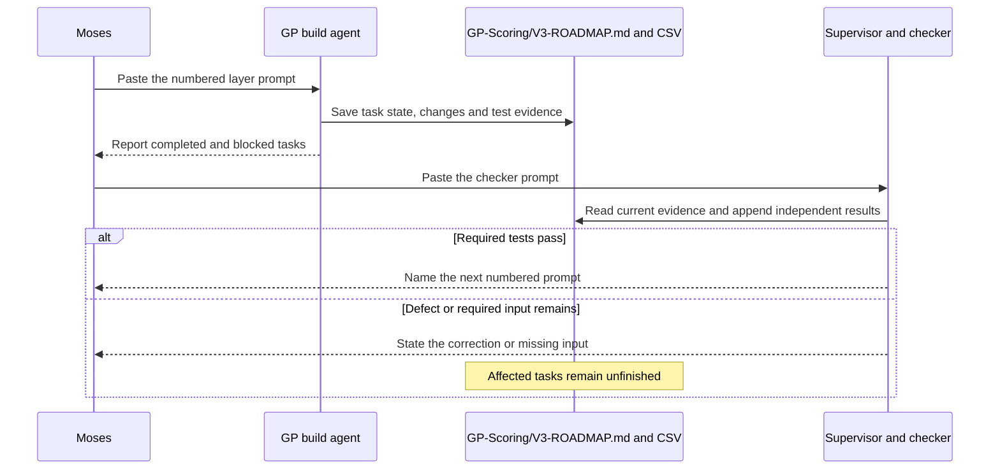

# GP Scoring dispatch prompts

Written for Moses, who needs complete messages to paste into agent chats.

Copy Prompt 1 into the GP build agent's chat first. Copy the checker prompt into the supervisor's chat after each completion report. After a passing review, send the next numbered prompt to the same build agent; a fresh agent can use the same prompt. Each block is a complete message with the project paths already filled in.

| Message | Recipient | Work | When to send |
|---|---|---|---|
| [Holdings handover](#holdings-handover-message) | Existing holdings repair agent | Finish its assigned repair and record evidence. | Send once to the agent already doing the repair. |
| [Prompt 1](#prompt-1-build-foundation) | GP build agent | Protect existing results and create the build entry point. | Send now. |
| [Prompt 2](#prompt-2-population-and-data-contracts) | Same GP build agent | Build fund histories, table definitions and source adapters. | After the checker accepts Prompt 1's independent work. |
| [Prompt 3](#prompt-3-holdings-accounting-and-database) | Same GP build agent | Build investment events, balances and the analytical database. | After its required Prompt 2 tasks pass. |
| [Prompt 4](#prompt-4-analytics-and-scoring) | Same GP build agent | Calculate company, fund and manager measures and scores. | After its required data and accounting tasks pass. |
| [Prompt 5](#prompt-5-scenarios-and-dashboard) | Same GP build agent | Build working controls and company/deal views. | After analytics pass. |
| [Prompt 6](#prompt-6-document-search-and-questions) | Same GP build agent | Connect document search and database questions. | After the dashboard and analytical database pass. |
| [Prompt 7](#prompt-7-final-verification-and-documentation) | Same GP build agent | Finish tests, documentation and local publication. | After the preceding software tasks pass. |
| [Checker prompt](#checker-prompt-reuse-after-each-layer) | Supervisor, this chat | Inspect the latest completed work and its evidence. | Reuse after each layer. |

Seven build prompts use one build agent; a missing external input blocks only its dependent tasks, which remain unfinished in the worklist.



## Holdings handover message

Paste this into the existing holdings repair chat; it adds the handover requirements to that agent's assignment.

```text
Continue the holdings repair already assigned to you in C:\Users\Moses\Alts-ETL-Analytics-Project. This message adds handover requirements for the GP Scoring upgrade within the existing repair scope.

Complete the upstream fixes for currency-parenthesized negative numbers, source summaries counted as individual positions, and owner-versus-investee errors in the legacy fund_holdings.csv table. Keep normalized positions as the authoritative holdings records. Derive legacy compatibility rows from reviewed owner relationships and preserve the distinction between market value and fair value. Keep the adjudicated source records unchanged. Add focused regression cases to the existing tests, then regenerate the affected CSVs, databases, analytics and dashboard through the existing pipeline commands within your assigned repair scope.

Read C:\Users\Moses\Alts-ETL-Analytics-Project\GP-Scoring\V3-ROADMAP.md, including Repair handover. Leave GP build code, its worklist and the other agent's files unchanged. Keep .gitignore unchanged. Git commits, pushes, remote changes and paid provider calls remain outside this message's authorization.

Continue updating your existing repair log as each change and test finishes. Your final report must give the absolute paths of that log and any repair report, every changed code and output path, the source record IDs and before/after values, the commands run and their results, and any unresolved failure. Show that summaries remain in source evidence but are excluded from position totals, that the affected owners are corrected, and that CSV values agree with the corresponding database tables. Recompute current counts instead of copying the old report's counts. State whether every process writing shared outputs has finished and whether the files are ready for an independent reader. Preserve the pre-repair evidence needed to explain changes to protected inputs. Report completion for the holdings repair only.
```

## Prompt 1: Build foundation

```text
Implement the foundation of the GP Scoring upgrade in C:\Users\Moses\Alts-ETL-Analytics-Project. Read applicable AGENTS instructions, then read GP-Scoring\V3-ROADMAP.md and GP-Scoring\V3-ROADMAP.csv in full, including the live execution log. Read the audit files linked by the plan and the current GP README, V2 report, v2-baseline.json, run_v2.py and v2_inputs.py. Use the files on disk as the task record.

Your assigned tasks are V3-22 and the verification portion of V3-23. Inspect existing changes before editing. Preserve the last verified complete GP bundle and the code required to reproduce it using the archive path in the plan. Keep the original baseline record, historical V1 scores and parent synthetic inputs unchanged. An intermediate output from another agent's active rebuild is ineligible as a replacement baseline. If the necessary pre-repair evidence is missing, record the specific gap and continue independent foundation work.

Implement the planned run_assessment.py entry point, legacy compatibility checks, fixed candidate output paths and recovery behavior. Provide build, check-only, check-legacy, stage selection and resume operations. Verify that an interrupted candidate build leaves the last complete report recoverable and that resume checks the actual saved inputs and outputs. Keep rules in the authored CSV policies where the plan requires them. Reuse existing calculations and checks; an additional orchestration service remains outside this assignment.

Another agent owns the upstream holdings repairs and parent rebuilds. Read its completed handover when available and verify the signs, summary exclusions, legacy owners and regenerated outputs required by V3-23. Record only verified source-derived input changes in GP-Scoring\data\input-approvals.csv. Leave V3-23 BLOCKED if the handover or independent acceptance is absent. Keep its repair files and active publication under its ownership. V3-22 can finish while V3-23 remains pending if its own evidence is complete.

Update the existing Markdown execution log and CSV worklist at task start, after each material change or test, and before stopping. Record commands, results, changed paths, reasons and the next unfinished step. Preserve previous log rows. Follow the plan's permissions: keep .gitignore, adjudicated records and other agents' work unchanged; provider calls, commits, pushes and remote changes remain prohibited. Add and run focused foundation and compatibility tests. Finish with the completed task IDs, any blocked IDs, test results and a request for the checker prompt. Stop at this layer; Prompt 2 requires a subsequent dispatch. If the session is interrupted, a replacement agent must be able to resume from the saved log alone.
```

## Prompt 2: Population and data contracts

```text
Implement the population and table-contract layer of GP Scoring in C:\Users\Moses\Alts-ETL-Analytics-Project. Read applicable AGENTS instructions, GP-Scoring\V3-ROADMAP.md and its sibling CSV in full. Inspect the live log and verify the completed prerequisites for V3-01, V3-02, V3-03, V3-04, V3-06, V3-07, V3-19 and V3-20. These are the only work items assigned by this prompt. Reuse existing completed work; keep tasks with unmet prerequisites pending while completing independent tasks.

Read the plan's Current behavior, Expansion, Holdings and Existing data decisions sources. Build a separate add-on population of coherent manager-and-mandate fund series, with dated firm and team observations, fund size and currency, mandate targets and explicit first-time, partial and multi-strategy cases. Start with the plan's small population and keep the same configured paths for the larger population. Preserve existing parent synthetic data and historical scores. Keep generator traits out of the scoring inputs and prove that the same inputs and seed reproduce the retained records.

Reuse the six existing holdings table contracts for owners, investment targets, instruments, dated positions, indirect relationships and field evidence. Define consumed company-financial, investment-event, investor-event and deal tables with stable keys, dates, units, currencies and origin information. Store each company-and-period fact once and reference it from its owners. A fund interest establishes only the investment in that fund; underlying company claims require their own evidence. Keep missing values distinct from zeros.

For V3-19 and V3-20, inspect the actual admission and discovery records and use completed reviewed source outputs. Preserve the distinction between investor-led secondary sales and manager-led continuation transactions, and retain each statistic's caption, footnote and measurement period. V3-20 consumes the corrected holdings only after V3-23 is accepted. New extraction must follow the existing independent reader and adjudication contracts. If required source work is unfinished, record the source ID, missing artifact and owning task; prepare source-specific copy-paste dispatches in the existing extraction dispatch location for Moses to authorize. Independent reader roles require distinct authorized readers; adjudication remains mandatory, pending evidence stays unpublished and active extraction files retain their existing owner. Continue the isolated schema and synthetic tasks while those source tasks remain blocked.

Write policy decisions as input CSV rows using the plan's contracts. Add focused tests for record keys, ownership, population separation, predecessor ambiguity, dates, currencies and repeatability. Run the owning layer tests and legacy compatibility checks; save actual results. Update the existing execution log and worklist after each task and material test, with changed paths and restart instructions. Keep .gitignore and adjudicated evidence unchanged, and keep provider calls, Git writes and competing shared pipeline rebuilds outside this task. Report completed and blocked task IDs and stop for the checker prompt before the next layer.
```

## Prompt 3: Holdings, accounting and database

```text
Implement the holdings and accounting layer of GP Scoring in C:\Users\Moses\Alts-ETL-Analytics-Project. Read applicable AGENTS instructions, GP-Scoring\V3-ROADMAP.md and its sibling CSV in full, then verify the current outputs and checker evidence for your prerequisites. Your assigned tasks are V3-05, V3-08, V3-09, V3-24 and V3-26. Follow their recorded dependencies instead of treating a prior agent's summary as proof.

Read the current population contracts, generate_v2_cases.py, v2_analysis.py, v2_features.py, the normalized holdings definitions and the relevant existing finance calculations. Generate dated purchases, follow-on investments, operating observations, income, partial and full exits, write-offs, fees, borrowing and repayment before deriving position values. Keep company receipts distinct from investor calls and distributions. Use separate registered valuation methods for company equity, credit and fund interests. Keep negative source positions signed and exclude source summaries from individual-position totals.

Reconcile investment cost, investment value, fund cash and assets less liabilities to fund NAV. Prove the arithmetic with hand-calculated small examples, including partial disposals, retained cash, recycling, non-base currencies and missing conversion inputs. Keep historical cash events unchanged. Calculate net investor returns from investor events and gross investment returns from investment events. Preserve null values and report the specific input missing from an unavailable calculation.

Implement supported indirect ownership with dated economic weights and observed-coverage fields. Reject cycles and duplicate counting of a fund interest together with its underlying exposure. Build the planned GP analytical database and CSV exports from the same validated tables. Each table or view must have a dashboard or question-answering consumer. Verify identical keys, row counts and values between the CSVs and this database. Keep add-on simulation writes out of the parent warehouses.

For V3-26, use reviewed source inputs only after V3-20 and the holdings handover are accepted. Preserve every reported cell. Store simulated gap-filling values with their method, source references and population label, and identify unsupported residual allocations as generated. Keep source-only results separate from source-supported simulations and fictional rankings. If source prerequisites remain pending, complete independent synthetic accounting and database tasks and leave V3-26 blocked.

Add and run the focused accounting, holdings, database-parity and repeatability tests, plus the legacy checks affected by this layer. Save each result and changed path after the action in the existing Markdown execution log and CSV worklist. Keep .gitignore, source adjudications, parent synthetic data and other agents' active files unchanged. Provider calls, Git writes and a concurrent parent release remain prohibited. End with completed tasks, blocked tasks, reconciliation results and the files the checker must inspect; stop before Prompt 4.
```

## Prompt 4: Analytics and scoring

```text
Implement the analytical and scoring layer of GP Scoring in C:\Users\Moses\Alts-ETL-Analytics-Project. Read applicable AGENTS instructions, GP-Scoring\V3-ROADMAP.md and its sibling CSV in full. Verify the saved prerequisite data and checker results. Your assigned work items are V3-10, V3-11, V3-12, V3-13, V3-14 and V3-15. Read the existing scoring.py, v2_features.py, v2_analysis.py, v2_diligence.py, relevant policies and the new validated population tables before changing calculations.

Implement the plan's size, experience, team continuity and capacity measures using compatible currencies, mandates and dates. Keep first-time managers and ambiguous predecessors identifiable. Implement sector and geographic exposure, mandate drift, concentration and observed indirect-coverage measures. Calculate realized losses, completed-investment hit rates, dependence on the largest winner, like-for-like pre-exit valuation error and value-change decomposition. Preserve the difference between realized outcomes and current marks, and make the decomposition reconcile to the total change.

Implement secondary-fund commitment, valuation-age, exposure and segmented market-comparison diagnostics only from their required inputs. Use market report averages as aggregate comparisons only; individual valuations require their own inputs. If V3-19 or another prerequisite is incomplete, keep the dependent result unavailable and its task unfinished and keep the missing input unresolved. Continue independent analytical tasks.

Implement the historical 60/40 comparison, the labelled current-population 60/40 calculation and the optional five-category policy defined in the plan. Retain historical scores and ranks. Use the authored policy rows for formulas, eligible populations, direction, weights and missing-data treatment. Show component contributions, eligible peer counts and the reason a score is unavailable. Exclude size and age alone from quality points, and exclude synthetic completion from purported real-manager rankings. Keep display filtering distinct from changes to the peer group.

Add hand-calculated cases for every new measure, ties, missing inputs, first-time managers, peer exclusions, disposal cost allocation and overlapping score components. Run the owning analytical tests and legacy compatibility checks. Record the actual command outputs, changed paths, completed IDs and unfinished dependencies in the existing log and worklist as the work happens. Preserve .gitignore, source records, parent synthetic inputs and other agents' files; keep provider calls, Git writes and shared parent rebuilds outside this task. Finish with the measures implemented, their tested examples and any blocked task IDs, then stop for the checker prompt.
```

## Prompt 5: Scenarios and dashboard

```text
Implement the scenario and dashboard layer of GP Scoring in C:\Users\Moses\Alts-ETL-Analytics-Project. Read applicable AGENTS instructions, GP-Scoring\V3-ROADMAP.md and its sibling CSV in full, then verify the completed prerequisites. Your assigned work items are V3-16, V3-17 and V3-18. Read v2_dashboard.py, v2_stress.py, v2_analysis.py, the current GP dashboard, scoring policies and analytical outputs. Preserve the current high-contrast colors and the existing GP dashboard location.

Implement the plan's operating, valuation, financing, currency and exit-timing scenarios by instrument type. Preserve the reported baseline and dated historical cash events. A zero-change scenario must reproduce the baseline. Reconcile scenario company values into fund balances, recalculate the affected performance measures, rebuild peer comparisons and recompute manager ranks. Treat market-based adjustments as scenarios with disclosed assumptions, dates and data coverage and keep reported valuations unchanged.

Wire every displayed control to its intended calculation. Provide population, strategy, eligibility, manager, fund-size and experience selections, policy weights, peer settings and the supported scenario controls. Display filters must only hide or show results unless labelled as peer controls. Validate weight inputs and policy import/export. Compare browser results against the Python reference on representative cases, including ties, missing data, negative values and partial histories.

Build working manager, fund-series, holdings, company and deal views. Display the origin, date, currency, units, calculation definition and coverage beside the relevant results. Keep fictional scoring separate from real-source evidence and preserve RAG Document Insights. Use tables for detailed records, readable explanations and source links that open the correct physical PDF page. Keep the removed print one-pager absent and give each control a tested function.

Test the actual dashboard in a local browser on desktop and narrow layouts. Exercise every control, reset, long names, empty results, downloads, source links and keyboard selection. Measure initial payload and response times against the plan's provisional targets and report measured exceptions. Use the existing local server where available; a temporary server must bind to loopback and expose only the required files. Save candidate output until the publication checks pass. Parent main-dashboard writes must wait for the holdings agent to release its shared write scope.

Update the existing log and CSV worklist after each command, browser test, change and interruption. Keep .gitignore, source evidence, historical scores and other agents' work unchanged. Provider calls, Git writes and public deployment remain prohibited. Report the tested local URL, implemented controls, test results and blocked IDs, then stop for the checker prompt before Prompt 6.
```

## Prompt 6: Document search and questions

```text
Implement the document-search and question-answering layer of GP Scoring in C:\Users\Moses\Alts-ETL-Analytics-Project. Read applicable AGENTS instructions, including the RAG folder instructions, then read GP-Scoring\V3-ROADMAP.md and its sibling CSV in full. Your assigned task is V3-25, which requires the verified analytical database and dashboard. Read RAG\src\alts_rag\gp_scoring.py, analytics.py, service.py, retrieval.py and assessment.py, their tests, and the GP dashboard's current document-search integration.

Reuse the existing keyword-first RAG engine; additional search services and account layers remain outside this assignment. Keep document results tied to the selected real manager, fund or deal and its reviewed sources. Preserve table-form results, physical PDF page citations and the existing credential-free local interaction. Keep fictional managers' quantitative simulation records separate from real-manager identities and authentic source documents.

Connect registered, parameterized read-only analytical queries to the GP analytical database. Support questions about performance, realized losses, concentration, size, experience, fees, valuation assumptions and available evidence when the required inputs exist. Resolve entity, population, dates, units and measurement scope before retrieval or calculation. Ask for clarification when identity is ambiguous, and state the missing input when the records are insufficient to answer a question. Keep the query registry narrow; model-generated arbitrary SQL is outside this task.

Build the planned answer adapter around an evidence packet of eligible database facts and source passages. Verify returned numeric assertions against their records and registered calculation results, and verify citations against the permitted document and page. Test wrong entities, stale dates, mixed populations, misleading document text, invented numbers, fabricated citations and conflicting evidence. Treat matching dashboard text as another view of the same underlying data; independent corroboration requires a different source. Keep answers read-only and prevent retrieved text from changing the model's instructions.

Implement and test the model adapter with fake responses and a network guard. Model, embedding-provider and paid-endpoint calls are prohibited. Record live-model validation as PENDING_APPROVAL until Moses selects the provider, model, spending limit and data scope. Deterministic analytical answers and keyword search must work on this computer before that approval. Preserve existing RAG behavior outside this integration.

Run the focused RAG, query, dashboard and legacy regression tests. Update the existing Markdown log and CSV worklist after each change and test, including the distinction between completed software and unrun live-provider validation. Keep .gitignore, source data and other agents' active files unchanged; keep Git writes, public deployment and competing parent rebuilds outside this task. Report working question examples, refusal cases, test results and the local URL, then stop for the checker prompt before Prompt 7.
```

## Prompt 7: Final verification and documentation

```text
Complete the GP Scoring upgrade's final verification and local publication in C:\Users\Moses\Alts-ETL-Analytics-Project. Read applicable AGENTS instructions, GP-Scoring\V3-ROADMAP.md and its sibling CSV in full. Your assigned task is V3-21. Read every preceding task's saved evidence and checker result and verify the actual files before treating it as complete. A pending extraction, repair, source acceptance or required software task prevents an end-to-end completion claim; identify it and continue only independent closing work.

Run the complete configured add-on build and its compatibility mode, then prove that the retained historical scores and parent synthetic inputs remain unchanged. Verify that every approved source-derived difference matches the holdings repair evidence and that the adjudicated source records remain unchanged. Check accounting reconciliation, CSV/database parity, population separation, repeatability and recovery from an interrupted candidate publication. Every new table or view must have its promised consumer.

Run the GP tests, relevant RAG tests, dashboard tests and the repository test suite once on the final candidate, preserving all existing assertions. Use Python with bytecode disabled and pytest's cache provider disabled. Follow the actual entry-point options implemented by the earlier tasks. The existing closing commands include python -B -m src.repository.release_audit and python -B -m src.repository.check_project_structure --verify-hashes. A parent publish or main-dashboard rebuild must use the current documented command contract and requires the holdings agent's completed handover, accepted V3-23 evidence and available shared databases. Reuse the evidence of a verified unchanged repair run; rerun only affected work whose inputs or implementation changed. Report a held database or active writer instead of killing it or bypassing its protection.

Publish the validated GP output to its existing local location. Exercise every dashboard page and control, source download, PDF citation and document search in a real local browser. Confirm the main dashboard retains its GP link and RAG option and that displayed counts come from the current output. Compare browser calculations against the Python reference and save measured performance. Keep the last complete report recoverable if publication fails. This dispatch authorizes local publication only; a GitHub push or online deployment requires a separate request.

Update the GP README and architecture, each affected stage README, relevant root README and PROCESS descriptions, and the relevant Expansion records to match the implemented system. Define unfamiliar measures in plain language and distinguish reported, generated and scenario values. Regenerate affected guides, lineage, manifests and dashboard in the repository's current dependency order; verify the structure last. Run the local editorial checker on changed prose and fix its ban findings.

Keep the worklist and append-only execution log current throughout. Keep .gitignore unchanged and keep provider calls, Git commits, pushes and remote changes prohibited. Record commands, outcomes, changed paths, local dashboard addresses, remaining authorization dependencies and the next action in the existing log. End with a concise final report for the independent checker. State which software is verified and which live-provider or source-dependent work remains pending; report unfinished tasks as pending.
```

## Checker prompt: Reuse after each layer

```text
Conduct an independent check of the latest completed layer of the GP Scoring upgrade in C:\Users\Moses\Alts-ETL-Analytics-Project. Read applicable AGENTS instructions, GP-Scoring\V3-ROADMAP.md, its sibling CSV and GP-Scoring\DISPATCHES.md. Locate the latest completed tasks that lack a subsequent checker entry in the execution log. Read their current code, policy rows, outputs and test evidence, and verify the agent's final message against those files. If every completed task already has a current checker entry, report that state instead of repeating an old acceptance.

Identify the layer and task IDs being checked. Verify their prerequisites, actual source inputs, required calculations and named consumers. Reproduce representative results using calculations separate from the implementation, including missing values and failure cases. Confirm that corrected source signs, summary exclusions and owner relationships are retained where this layer consumes holdings. Check the historical scoring baseline, population separation and affected CSV/database agreement. Run the focused tests appropriate to the changed code; reserve the full repository suite for final closeout unless a specific defect requires it earlier. For a dashboard layer, exercise the affected controls and citations in a local browser; screenshots and HTML builds alone are insufficient evidence of working controls.

Inspect the changed-path set for unauthorized scope changes and active work by another agent. If a defect belongs to the completed GP layer and its files are free of active writers, fix it and rerun the affected tests within the layer's existing permission boundary. Keep every correction and its reason in the log. If the defect belongs to the active holdings repair or extraction work, record its source evidence and return it to that owner instead of duplicating the repair. Keep .gitignore, adjudicated records and parent synthetic inputs unchanged. Provider calls, Git history writes, pushes, deployment and competing parent releases remain prohibited.

Append a checker entry for each reviewed task in the existing Markdown execution log, with the actual tests, result, changed paths and any corrections. Update its CSV evidence to identify the checker result; mark a failed required task BLOCKED with the specific reason. Preserve earlier log rows and distinguish a verified independent task from an incomplete layer. Only a completed test of the current relevant state qualifies as a pass.

Return PASS, PASS FOR INDEPENDENT TASKS or FAIL, list the checked task IDs and any corrected or remaining defects, and name the next numbered prompt from DISPATCHES.md that Moses can paste. If a prerequisite is missing, provide a complete ready-to-paste correction message with the actual paths and task IDs already filled in. Provide the correction instructions as complete sentences ready for Moses to paste.
```
