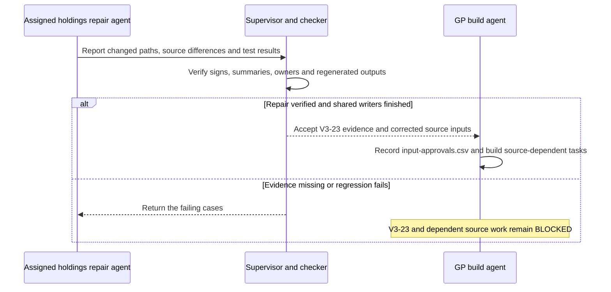

# GP Scoring build plan

Written for the implementing engineer, with Python experience who is new to this add-on.

Build company-level analytics and an interactive manager-assessment dashboard from the contracts below, retaining the current scores and source evidence.

| State | Contract |
|---|---|
| Plan | Ready for dispatch; execution is pending. This replaces the earlier V3 proposal. |
| Dispatch messages | [Complete layer prompts](DISPATCHES.md) contain the messages Moses pastes into the build and checker chats. |
| Repository | C:/Users/Moses/Alts-ETL-Analytics-Project |
| Worklist | The sibling CSV contains ordered tasks and acceptance criteria; V3-23 is BLOCKED pending the assigned holdings agent's handover; other READY rows remain subject to their dependencies. |
| Audit | [Verified corrections](../audit/notes/gp-scoring-upgrade-review.md) and [evidence](../audit/notes/gp-scoring-upgrade-review.csv), G01–G17. |
| Execution | Complete every unblocked task and record evidence as it finishes; the required result is tested software and data. |
| Permissions | Local code changes and verification only. Commits, pushes, remote changes, provider calls, paid downloads and credential changes require Moses's approval; .gitignore remains read-only under every circumstance. |
| Other work | One agent owns the GP build; Moses's assigned holdings agent owns the source repairs and affected parent rebuilds. Preserve its files and active schema-discovery work; shared files have one writer at a time. |
| Exclusions | One-Day Pricing development, model training, a new orchestration service and a user-account system remain outside this dispatch; the extraction contract remains unchanged. |

## Definitions

| Term | Meaning |
|---|---|
| GP | General partner, the manager of a fund. |
| NAV | Net asset value: investments plus cash and other assets, less liabilities. |
| AUM | Assets under management; each record must state whether it measures current managed value or committed capital. |
| TVPI | Distributions plus remaining value, divided by investor paid-in capital. |
| DPI | Distributions divided by investor paid-in capital. |
| RVPI | Remaining value divided by investor paid-in capital. |
| IRR | Annualized return calculated from the dates and amounts of investor payments and terminal value. |
| KS-PME | Benchmark-adjusted distributions plus remaining value divided by benchmark-adjusted contributions. |
| Peer percentile | Percentage of eligible comparison values below a value, with half credit for ties. |
| Look-through | Economic exposure to an underlying investment through a fund interest. |
| Fixture | Generated test population, distinct from extracted source records. |

## Read-first sources

| Area | Files to read before its task |
|---|---|
| Governing instructions | Applicable user and repository AGENTS files, including instructions in any RAG or extraction subfolder before its files change. |
| Current behavior | GP-Scoring/README.md, ARCHITECTURE.md, V2-IMPLEMENTATION-REPORT.md, policy.json, v2-policy.json, v2-baseline.json; audit G01–G17. |
| Existing implementation | GP-Scoring/scoring.py, v2_inputs.py, v2_features.py, v2_analysis.py, v2_stress.py, v2_diligence.py, generate_v2_cases.py, run_v2.py, v2_dashboard.py, tests/. |
| Expansion and source status | TODO.md, Expansion/EXPANSION-LEDGER.md, Expansion/Data/REPORT.md, 04-admission/admission-ledger.csv and 05-handoff/ under Expansion/Data/. Read the latest discovery log alongside its status summary. |
| Holdings | Expansion/holdings/E01-ARCHITECTURE-MAP.md, its field/consumer maps, sql/duckdb/02_fund_level_ddl.sql, src/load/build_normalized_holdings.py, validate_normalized_holdings.py and tests/test_normalized_holdings.py. |
| Holdings handover | The assigned repair agent's report, changed-path record, before/after values and regression results; record their actual paths under V3-23 when available. |
| Existing data decisions | src/common/matrices.py, data/normalization/transformations/, src/generate/generate_synthetic_funds.py, src/pipeline/publish_review_release.py. |
| Diligence | RAG/src/alts_rag/gp_scoring.py, analytics.py, service.py, retrieval.py, assessment.py and their tests; GP-Scoring/data/ case schemas. |
| Design evidence | GP-Scoring/research/ reports and the relevant holdings/deal proposals in Expansion/holdings/; verify design claims against code and sources. |

## Binding decisions

| Decision | Build rule |
|---|---|
| Historical population | Parent data/synthetic/clean and V1 inputs, code and scores remain unchanged; an add-on population supplies the new histories. |
| Historical verification | Keep v2-baseline.json as the original record. Preserve the last verified complete V2 bundle and required GP code in archive/legacy-review.zip; test recovery and retain it unchanged on later builds. An in-progress parent rebuild is ineligible as a baseline; absent pre-repair evidence stays BLOCKED. |
| Required upstream repairs | The assigned holdings agent repairs signed parsing, summary admission and legacy owner relationships. V3-23 verifies and consumes its completed work; these repairs remain outside the GP agent's write scope. |
| Baseline exceptions | A source repair can change protected extracted tables or warehouse files. Record named affected paths, before/after values or table differences, reason and tests in GP-Scoring/data/input-approvals.csv. Only listed source-derived changes qualify; V1 values and parent synthetic values remain fixed. Compatibility validation reads these approvals alongside the unchanged original baseline. |
| Active report | GP-Scoring/06-report/dashboard.html remains the one current dashboard; historical scores appear under a labelled legacy population. |
| Candidate population | Default to coherent series within manager and mandate; retain first-time, multi-strategy, currency, loss and missing-data examples. |
| Headline policy | Historical 60/40 remains the default comparison. Applying it to the new population means new scores; only the legacy population reproduces the old numbers. |
| Size and experience | Mandatory diagnostics and peer controls; size and age receive diagnostic values only. The optional five-category policy below uses defined capacity measures. |
| Real data | Source-only analysis and source-supported simulations have different population IDs; simulated completion remains labelled simulation and stays outside real-manager rankings. |
| Configuration | Numerical assumptions, thresholds, vocabularies, signs and routing rules are CSV inputs, using src/common/matrices.py where its contract fits. JSON stores UI selections and receipt metadata; the CSV rules remain authoritative. |
| Scale | Begin with a representative small population; the release population target is 200 managers with configured fund series; position counts follow the tested histories. Counts come from the manifest. |

## Repair handover

The GP agent continues isolated configuration, schema and synthetic-population work while source-dependent tasks await the repair review.



| Handover requirement | Acceptance |
|---|---|
| Signed values | SRC407's currency-parenthesized negatives retain their printed signs; regression cases cover currency symbols before parentheses. |
| Summary rows | Summaries remain source evidence and are excluded from individual-position counts and totals; current counts reconcile by record ID. |
| Ownership and value basis | Affected extracted fund_holdings.csv rows derive their owners from reviewed normalized relationships; owners differ from investees where the source distinguishes them; market value and fair value remain distinct. |
| Published outputs | Affected CSVs, warehouse tables, analytics and dashboard values reconcile after the repair's owning stages rerun; changed values have source-backed explanations. |
| Protected evidence | Adjudicated records, parent synthetic values and historical V1 scores remain unchanged; input-approvals.csv records only verified source-derived changes. |
| Write scope | The GP agent consumes normalized positions as the authoritative holdings inputs; parent release, database and main-dashboard writes require the holdings agent's completed handover and released write scope. |

## Policy table contracts

Matrix-backed files start with input_value,output_value,decided_by,evidence,note and use context for conditional mappings; optional columns below carry typed parameters, with boundary and duplicate-identifier tests.

| Family under policies/ | Additional content |
|---|---|
| population-rules.csv | Strategy/mandate, parameter, value type, unit, seed, population size, fund intervals, currency, sector and company-path assumptions. |
| metric-definitions.csv | metric_id, method_id, input tables/fields, grain, numerator, denominator, unit, orientation, required fields, availability rule and aggregation. |
| peer-rules.csv | policy_id, matching fields, vintage/age window, size-band limits, minimum funds/managers, same-manager exclusion and fallback behavior. |
| score-components.csv | policy_id, category_id, component_id, metric_id, weight, direction, eligible population and missing-data rule. |
| scenario-rules.csv | scenario_id, parameter, base value, range, step, unit, valuation method, timing convention and affected metrics. |
| proxy-mappings.csv | Instrument/sector/strategy, benchmark ID, currency, beta assumption, level/return basis, rights status and date coverage. |

Python implements registered calculation methods; authored policy rows select them and state their meaning. Unknown methods and missing rules fail; CSV policies are inputs to the code.

## Verified starting state

Measurements from 2026-09-14 describe the starting population; the new population has its own measured results.

| Measure | Value |
|---|---|
| Current fixture | 200 managers; 800 funds; 640 manager-strategy groups; 495 single-fund groups. |
| Eligibility | 38 ranked; 325 partial; 277 insufficient. Partial means positive eligibility below either threshold, including six groups with two qualifying funds out of three. |
| Existing holdings | 89,503 rows; 58 quarter ends; 4,475 company IDs; 3–8 companies per fund. |
| Experience and size | 150 predecessor links; 103 usable size comparisons; 47 currency mismatches. |
| Existing manager observations | 200 AUM and 200 fund-count records; define their economic meaning before reuse. |
| Current source intake | Ten admitted PDFs and 21 held native files; extraction completion requires its own evidence. |
| Source prerequisites | The assigned agent's repairs to SRC407 signs, summary admission and legacy owners require verification before new analytics consume affected positions. |

## Build and output contract

New names below are planned code and output paths; reuse existing calculations through tested input adapters.

```mermaid
sequenceDiagram
    participant E as run_assessment.py
    participant P as population/*.csv and policies/*.csv
    participant A as assessment.py and existing v2 calculations
    participant C as candidate/ stage outputs
    participant R as 06-report/dashboard.html
    E->>P: Read approved population, dates and policy
    P-->>E: Typed records and origin references
    E->>A: Calculate events, balances, features and scenarios
    A-->>C: Write stage tables, evidence and verification results
    alt required accounting, compatibility or parity test fails
        C-->>E: Fail with affected record IDs
        Note over R: Last complete report remains active
    else required tests pass
        E->>R: Publish validated tables and dashboard
        Note over E,R: Recovery bundle saved first; receipt written last
    end
    Note over E,C: A restart reuses a stage only when its inputs, rules and outputs match its successful receipt
```

| Component | Reads and writes |
|---|---|
| run_assessment.py | One new entry point: build, check-only, legacy-check and stage selection; default operation is offline. |
| population.py | New generator/adapters; reads approved source records and configuration; writes population/. Reuse existing case-event and holdings schemas. |
| assessment.py | New shared calculation adapter; reuses existing returns, terms, peer and company calculations; writes 04-diagnostics/. |
| policies/ | Minimal CSV families for population assumptions, measurement definitions, peer rules, score components, scenarios and proxy mappings; one file per family. |
| population/ | Authoritative add-on inputs and generated accounting records; manifest names each population and every table. Same paths for pilot and full population, with size in configuration. |
| 04-diagnostics/ | Existing tables plus company, deal, exposure, source-comparison and score-contribution results; assessment.duckdb contains these same tables and only the views that the dashboard or RAG reads. |
| 05-scenarios/ | Scenario definitions, fund/company effects, manager scores and rank sensitivity; baseline rows remain unchanged. |
| 06-report/ | Existing dashboard URL, downloadable tables, bounded data payloads, checks.csv and receipt.json. |
| candidate/ | One static staging root with the same stage layout; folder names stay fixed across builds. |
| archive/ | Complete replaced bundle with one README row explaining its closure; reuse the established recovery approach and validate every resolved path before cleanup. |
| Data lineage | Every result cites population, entity, observation IDs, method/rule ID, dates, units and source or generator parameter rows; reuse the existing evidence map. |

## Minimum table contracts

Existing six-table holdings definitions remain authoritative; additions require a reader, a writer and a test.

| Table or family | Record grain and required fields |
|---|---|
| Population manifest | population_id, origin category, economic_date, information_cutoff, seed/configuration reference, source snapshot, table paths and counts; comparisons stay within their declared population. |
| Manager and fund observations | Manager/date and fund/date, with stable IDs, strategy/mandate, sequence, founding/first-close date, commitment, currency, active managed NAV, cumulative fundraising, team count and measurement basis. Reuse existing observation categories. |
| Mandate and team history | Fund/sector target with effective dates and weights; person/manager role with start/end dates and fund/deal attribution. Unstated source mandates remain unknown. |
| Six holdings tables | investment_owner, investment_target, investment_instrument, fund_position, lookthrough_edge, holding_field_lineage; retain source IDs and canonical owner/target separation. |
| Company financials | Company, period and statement scope: revenue, operating profit/margin, debt, cash, currency, units, publication date and origin; prevent duplicate company facts when several funds hold it. |
| Investment events | event_id, owner/fund, instrument, deal, effective date, cash settlement date, event type, quantity, gross amount, fee/tax, currency, FX reference, counterparty and origin; purchase, follow-on, sale, income, write-off and debt events are distinct. |
| Investor events | Fund/date: calls, distributions and investor fees with signed amounts and investor scope; company receipts and investor payments retain distinct event types. |
| Fund balances | Fund/date/currency: investments, cash, receivables, other assets, borrowings, accruals, other liabilities and NAV; link movements to events. |
| Deals | deal_id, related instruments/entities, transaction kind, effective dates, price/commitment, ownership transferred, status and evidence; announced, signed, closed, cancelled, realized and written-off are distinct states. |
| Valuations | Instrument/date/method: reported value, scenario value, enterprise/equity basis, operating inputs, ownership, currency/FX, proxy and available-at date; the reported mark remains unchanged. |
| Secondary-market statistics | Source/page, transaction segment, strategy, observation period, NAV reference date, statistic type, price/NAV basis, weights/sample caveat and value; market aggregate rows retain their own statistical grain. |
| Completion and calibration | Source entity/field/date, reported value, simulated value, method/parameters, residual, unit and source record; retain every observed value and distinguish generated detail from observed detail. |

All tables require population_id, stable keys, explicit measurement dates and field origins where values mix sources; missing numeric values remain null, zero remains zero, percentages and units retain their declared basis.

## Economic generation and accounting

| Requirement | Calculation or test |
|---|---|
| Fund series | Configured first-close intervals and strategy continuity; group predecessors by manager and mandate; same-year ambiguity remains visible and requires evidence before a predecessor is assigned. |
| Test population | First prove one primary mandate with at least 12 distinct managers and multi-fund histories; add explicit first-time, multi-strategy, non-base-currency, partial and complete-history cases; scale only after accounting passes. |
| Operating histories | Generate purchases and operating paths before deriving company values and fund results; keep latent generator traits out of analytical features. |
| Mean reversion | Apply bounded, documented strategy/sector assumptions to selected operating ratios or valuation multiples; company size and return retain their event-driven variation; simulation parameters describe economic assumptions. |
| Company equity | Operating profit times valuation multiple gives enterprise value; less net debt gives equity value; apply the equity zero floor only where the instrument warrants it, then ownership and FX. |
| Credit and fund interests | Debt uses instrument cash flows, interest, defaults and recoveries; fund interests use underlying NAV and supported ownership. Each instrument uses its registered method. |
| Position cost | Opening cost plus purchases, less cost allocated to sales/write-offs; historical cost follows transaction amounts. Retain closed positions and their event histories. |
| Investment rollforward | Opening investment value plus purchases, less carrying value of disposals, plus valuation changes and FX effects equals closing investment value. |
| Cash rollforward | Opening cash plus calls, investment receipts and borrowing, less purchases, investor distributions, operating costs, taxes and repayments equals closing cash; classify interest and fees once. |
| NAV | Investment values plus cash, receivables and other assets, less borrowings, accruals and other liabilities; negative source positions remain signed. |
| Fund return measures | Same-date and same-scope TVPI = DPI + RVPI when paid-in capital is positive; use investor cash flows for net IRR and separate investment cash flows for gross returns. |
| Fee and borrowing effects | Effective-dated fee bases, carry and facility interest follow their configured contracts; cash retention, recycling and borrowing remain explicit events and balances. |
| Reconciliation rounding | Tolerances follow recorded units and source rounding; missing terms or unconverted currencies produce an unavailable result, with a specific missing-input reason. |
| Repeatability | Same inputs and seed reproduce values, identifiers and order; retained entities keep their identifiers and sampled histories when the population expands. |

## Required analytics

| Feature | Definition and boundary |
|---|---|
| Size | Currency-comparable commitment bands, within-peer size percentile, fund-to-predecessor size ratio; reported and converted values remain distinct. |
| Experience | Fund sequence, first-close tenure, first-time status, completed realizations, attributable team tenure and team changes; founding and first-close dates require distinct records. |
| Capacity | Managed NAV and committed capital per investment professional as distinct measures; workload and size-step changes after weak predecessor results are diagnostics. |
| Sector | Stated mandate versus current company exposure; mandate drift = half the sum of absolute sector-weight differences; report unclassified exposure and coverage. |
| Company and sector concentration | Largest and top-three shares, sum of squared weights, currency and valuation date; denominator and indirect coverage are explicit. |
| Realized loss and hit rate | Cost-weighted realized losses and proportion of completed investments above the configured return threshold; active valuation losses remain a distinct measure. |
| Winner dependence | Largest positive investment gain divided by all positive gains; recompute the portfolio return after removing that investment's cost, proceeds and remaining value. |
| Mark-to-exit error | Like-for-like proceeds for the disposed interest versus its last eligible pre-exit mark; match ownership, currency and date, with lag shown. |
| Value decomposition | Separate changes from operations, valuation multiple, debt, ownership and FX; a stated sequential decomposition sums to the total change and describes arithmetic effects only. |
| Fund performance | Existing multiples, net IRR, benchmark comparison, capital recovery, cash conversion, same-age returns and borrowing diagnostics remain available. |
| Consistency | Dispersion, median, worst fund, trend and rank stability within one mandate; define mature-fund eligibility and report the eligible denominator. |
| Indirect exposure | Multiply compatible economic weights through dated links; coverage_fraction measures observed detail; ownership uses economic weights; prevent cycles and duplicate counting of fund NAV plus its child exposures. |
| Secondaries | Unfunded commitments relative to NAV, valuation age, owner/manager concentration, source-segment price comparisons and continuation-versus-investor-led transactions. |
| Calibration | Compare generated ranges and accounting residuals with supported source observations; reserve managers/time periods for holdout checks and label synthetic recovery tests as simulation results. |

## Scoring policies

All formulas, orientations, cutoffs and weights below become authored CSV rows with evidence or an explicit author-assumption label.

| Policy | Formula |
|---|---|
| Historical 60/40 | Existing TVPI/DPI percentiles, manager eligibility and aggregation on the legacy population; legacy scores and ranks are retained unchanged. |
| Current-population 60/40 | Same arithmetic on the new population with the active peer policy; label population and comparison counts. |
| Optional five-category | 40% track record, 20% realization, 15% consistency, 15% capacity discipline, 10% alignment; complete only when every positive-weight component has its required data. |

| Category | Initial configurable components |
|---|---|
| Track record | 50% TVPI percentile, 25% DPI percentile, 25% KS-PME percentile; match vintage/age, currency, scope and benchmark convention. |
| Realization | 50% inverse realized-loss percentile, 50% distribution-pace percentile; NAV reliance remains a diagnostic. |
| Consistency | 50% lowest mature-fund track-record points, 50% inverse dispersion percentile; use the same fund-performance definition and mature-fund sample in both terms. |
| Capacity discipline | 50% inverse expansion-risk percentile, 25% inverse workload-growth percentile, 25% attributable team-retention points; first-time status and size are diagnostics. |
| Alignment | 50% cash GP-commitment percentile, 25% inverse management-fee percentile, 25% inverse carry percentile among compatible term structures; governance clauses and conflicts remain named diagnostics. |

| Rule | Required behavior |
|---|---|
| Point scale | Peer percentiles range from 0 to 100; inverse percentile means 100 minus the percentile. Each category combines points on that same scale. Zero or missing denominators produce an unavailable ratio with its reason. |
| Realized receipts | Investment receipts include sale, income and recapitalization cash attributable to the disposed interest, less deal costs; fund management fees and investor carry stay in the investor-return calculation. The initial hit-rate cutoff is a realized investment multiple above 1.0, stored as an author assumption. |
| Capacity formulas | Expansion risk is max(size_step_up - 1, 0) when the predecessor's comparable performance percentile is below 25, else zero; workload growth is max(current managed-NAV-per-professional / predecessor equivalent - 1, 0); team-retention points equal 100 times retained attributable professionals / opening attributable professionals, with matched dates. Missing predecessors or team records produce an unknown risk measure. |
| Distribution pace | Trailing 12-month investor distributions / opening paid-in capital, requiring both boundaries and a positive denominator; compare funds of compatible age and strategy. |
| Realized loss | Sum of max(disposed cost - net realized proceeds, 0) / disposed cost; include only completed disposals with complete costs and proceeds. |
| Mature-fund default | At least five years since first call; apply the existing same-age snapshot rules; require three eligible mature funds for consistency and show coverage against all mature funds in that mandate. |
| Ranking eligibility | At least two qualifying funds and 75% relevant-fund coverage; first-time/partial rows retain their diagnostics and an unavailable headline rank. Optional composite prerequisites can be stricter but leave legacy status unchanged. |
| Aggregation | Track record averages eligible fund points; realized-loss ratios pool matched costs/proceeds before comparison; other fund ratios follow the metric's declared equal-weight or pooled rule. Manager-grain comparisons use their own eligible mandate/date/currency peer set. Aggregation requires compatible measurement definitions. |
| Missing inputs | Missing inputs produce an unavailable result with the absent input and weighted coverage. An explicit user zero-weight setting can exclude a component. |
| Overlapping measures | Publish component contributions and a correlation/sensitivity comparison; the five-category score is an authored assessment policy; predictive validity requires separate evidence. |
| Weight controls | Nonnegative weights with an explicit normalization action; all-zero and invalid weights are refused. Manager aggregation, ties and filters follow the declared policy. |
| Default ordering | Competition ranks for new policies, identical scores share a rank; preserve legacy rank behavior in the legacy comparison. Ranks remain within one strategy and population. |

## Scenarios and dashboard

| Control or view | Required behavior |
|---|---|
| Population and eligibility | Separate legacy, new fictional, source-only and source-supported simulation selections; label Ranking eligibility, show counts and define both Partial eligibility conditions. |
| Assumption controls | Weights, peer rules, size/experience criteria, revenue, margin, multiple, debt/interest, FX, sector shock and exit delay; every control names its units and affected calculations. |
| Comparison filters | Display filters hide rows only; peer controls rebuild comparison membership, eligibility and percentiles. A control that changes both must state both effects. |
| Scenario computation | Revalue instruments, reconcile fund balances, recalculate affected metrics and then percentiles/ranks; shocked values require updated percentiles. |
| Timing | Existing dated cash history stays unchanged; projected exit delays affect only future scenario events. Any retrospective timing example carries that label. |
| Benchmark adjustment | Start from valuation date, respect available-at cutoff and observed market coverage, retain reported marks, and state proxy, beta, debt, ownership and FX assumptions. Missing coverage produces an unavailable valuation. |
| First screen | Manager comparison, cash returned, remaining-value dependence, size, experience, concentration, coverage and score contribution; preserve current high-contrast colors and compact controls. |
| Drilldown | Manager to fund series to holdings to company and deals; table columns carry dates, units, origin and source links; charts read the same records. |
| Company analysis | Operating history, valuation changes, realized/remaining gains, loss and winner dependence, pre-exit mark comparison and scenario effects. |
| Secondaries | Underlying economic exposure and unknown residual, commitment requirements, NAV age and segmented market price comparisons. |
| Evidence | Each displayed number resolves to source rows or generator parameters and the calculation rule; source links open the correct physical PDF page. |
| Policy persistence | Export/import validated policy JSON containing selections and CSV policy IDs; the operator imports exported policies into later builds. |
| Runtime | All scoring controls work in the static browser; use bounded records and a worker only when measurements require it. Python reference and browser calculations must agree. |
| Payload targets | Provisional engineering targets: at most 15 MB initial dashboard payload and under 300 ms for ordinary filters/weights on the operator's browser; measure slow scenarios, show progress and record any justified exception. Repository size is measured across all published files, apart from individual-file limits. |

## Real sources, completion and questions

| Work | Contract |
|---|---|
| First real holding case | Reuse an existing reviewed source after the assigned holdings repair passes V3-23, then add one suitable new filing from the completed discovery/admission results; a matching HTML/XML pair represents one filing and one underlying source. |
| Native formats | Keep HTML/XML originals; use a deterministic structured adapter where the contract supports it and create page aids for human review. Native-only records cite their actual source and location. |
| Extraction boundary | New PDFs follow existing initial extraction, independent comparison and adjudication requirements; independence requires distinct authorized readers. Pending admission or adjudication remains a named external dependency; accepted finals and published evidence retain their source-review requirements. |
| Secondary reports | Read SRC613–SRC617 tables with their captions/footnotes; keep investor-led sales distinct from manager-led continuation transactions, distributions distinct from averages and reference-date NAV distinct from sale-date value. |
| Source-supported completion | Fill only documented gaps in an add-on simulation population, retaining reported cells; reconcile to available totals while real company identities and source records remain unchanged. Unsupported residuals remain identified synthetic allocations. |
| RAG search | Reuse RAG's keyword-first retrieval and existing resolved manager/fund/source mappings; the existing credential-free dashboard interaction stays unchanged. The local service retains its read-only document boundaries. |
| Quantitative questions | Existing allowlisted analytical queries read assessment.duckdb views; answers cite record IDs, formula, units, dates and population. Query execution is restricted to registered, parameterized read-only operations. |
| Free-form answers | Build an evidence packet from resolved entity IDs, eligible database facts and source passages, then verify every returned numeric assertion and citation against it; ambiguity or conflict produces a clarification or an unavailable answer. Display-derived text retains the authority of its underlying source. |
| Model boundary | Implement and test the adapter with fake responses and a network guard; provider model and embedding calls require Moses's approval of model ID, budget and data scope. Keyword search and deterministic analytical answers remain functional offline. |
| Completion reporting | Software completion and live provider validation have separate statuses; unapproved provider validation remains PENDING_APPROVAL. Answers are read-only. |

## Execution order

The CSV preserves the original work-item IDs and adds compatibility, repair, warehouse, questions and completion tasks; outputs under population/, policies/, numbered GP stages, candidate/ and archive/ are relative to GP-Scoring, while src/, RAG/, sql/ and instructions/ are repository-relative.

| Sprint | Items | Exit evidence |
|---|---|---|
| Foundation | V3-22, V3-23 | Initial state recorded, legacy bundle recoverable, assigned agent's completed holdings repair verified; independent tasks proceed after their own dependencies pass. |
| Population and schemas | V3-01–04, V3-06–07, V3-19–20 | Authored policy rows, consumed table contracts, coherent fund identities, actual source/admission state. |
| Events and holdings | V3-05, V3-08–09, V3-24, V3-26 | Reconciled balances, event histories, source observations and CSV/database parity on the pilot and full configuration. |
| Analytics | V3-10–15 | Defined metrics, contribution reconciliation, sample coverage, missingness and legacy equivalence. |
| Scenarios and interface | V3-16–18, V3-25 | Correct recalculation, usable company/deal tables, working citations, offline search and question tests. |
| Closeout | V3-21 | Regression results, current docs and manifests, recovery test, named remaining authorization dependencies. |

## Verification contract

Extend the owning tests and one closing report; each feature is covered by its owning tests.

| Family | Required cases |
|---|---|
| Legacy and source protection | Original V1 values/ranks unchanged; replay retained V2 calculations; named approved source deltas only; parent synthetic input protection; population-scoped joins. |
| Keys and dates | Duplicate instrument/company facts, wrong owner, ambiguous same-vintage predecessor, late publication, missing units, mixed currency, zero-versus-null and partial coverage. |
| Accounting | Purchases, partial exits, write-offs, fees, retained cash, recycling, borrowing and repayment; balances and net/gross returns reconcile; negative source signs, summary exclusions and corrected legacy owners stay correct; fair and market values retain their bases. |
| Features and policies | Hand-calculated small cases for every metric; ties, manager exclusion, same-age eligibility, insufficient peer samples, correlated components, first-time managers and incomplete categories. |
| Scenarios | Zero shock reproduces baseline; each control changes the intended result; nonlinear company/fund effects reconcile; peer changes rebuild percentiles; Python/browser parity within declared tolerances. |
| Database and evidence | Row/identifier/value parity with published CSVs; query results cite underlying rows; wrong-entity, stale-date, fabricated-number and unsupported-citation responses fail. |
| Interface | Every filter and view exercised on desktop and narrow screens; empty states, long names, negative numbers, keyboard selection, PDF page links, reset and policy import/export; zero page errors; every interactive control has a tested effect. |
| Recovery and repeatability | Stop a candidate build before publication and during replacement; last complete bundle remains recoverable; resume keeps one row per declared identifier; matching rebuilds produce identical analytical values; expected answers are reserved for tests. |

Existing commands below run from the repository root; the first records the pre-edit state, and the remaining commands apply to the affected build or final verification.

```powershell
python -B GP-Scoring/run_v2.py --check-only
python -B -m pytest GP-Scoring/tests -q -p no:cacheprovider
python -B -m pytest tests/test_normalized_holdings.py -q -p no:cacheprovider
python -B -m pytest RAG/tests tests/test_rag_dashboard.py tests/test_dashboard.py -q -p no:cacheprovider
python -B -m src.pipeline.publish_review_release
python -B -m src.dashboard.build_dashboard
python -B -m src.repository.release_audit
python -B -m src.repository.check_project_structure --verify-hashes
```

After replacing the active GP report, the new compatibility mode verifies the retained legacy bundle; the old receipt describes only its original output. Parent rebuilds require V3-23 acceptance, released shared-file ownership, the current command contract and available databases; retain the holdings agent's verified repair results instead of repeating its active run. Guides, lineage and manifests rebuild in dependency order, with the structure test last.

Implement the new entry point with --check-only, --check-legacy, --stage and --resume before using those commands; record actual commands and elapsed times, and run the repository suite once at closeout while retaining unrelated test assertions.

## Documentation and completion

| Deliverable | Acceptance |
|---|---|
| Code and data | Every new table has a named consumer; every feature has a test; parent databases remain the source for real observations, with an add-on database for GP analytical results. |
| Main and GP dashboards | Existing GP link and RAG option remain present; all displayed counts and labels come from the current report; online deployment requires a separate request. |
| Documentation | Update GP README and architecture, each changed stage README, root README/PROCESS and relevant Expansion rows to match implemented behavior; distinguish planned, implemented and pending external work. |
| Generated artifacts | Regenerate guides, lineage, manifests and dashboard in their existing dependency order; counts remain generated outputs. |
| Written quality | Professional declarative copy, defined measures, dates/units/origins, readable contrast; local editorial checker has zero bans for changed prose. |
| Final record | Worklist has per-task evidence; unresolved dependencies name the required files or approvals; completion report lists commands, results, changed paths and local dashboard address. |
| Done | All required software, accounting, data and interface tests pass on the delivered population; a pending new-source adjudication or live-provider test is stated as pending and excluded from completion claims. |

## Live execution log

Append at each task start, material decision, test and completion; update the CSV status to ACTIVE, DONE or BLOCKED with evidence, keeping prior log rows intact.

| seq | utc_time | item_id | state | artifact | command_or_result | reason |
|---|---|---|---|---|---|---|
| 1 | 2026-09-14 07:30:53 UTC | PLAN | READY | This plan and worklist | Audit G01–G17 incorporated; execution pending | Define the executable scope while current data and scores remain unchanged. |
| 2 | 2026-09-14 07:37:36 UTC | PLAN | CHECKED | Plan and worklist | 26 tasks; ordered dependencies; G01–G17 covered; language bans 0 | Writer flags retain defined measures, existing schema terms and literal source filenames. |
| 3 | 2026-09-14 07:56:26 UTC | V3-23 | BLOCKED | Plan and worklist | Moses assigned the repair to another agent; GP task changed to handover verification, including legacy owners | Prevent duplicate repairs and concurrent parent writes while independent GP tasks continue. |
| 4 | 2026-09-14 08:03:41 UTC | PLAN | DISPATCHED_TEXT | DISPATCHES.md | Seven layer prompts, a holdings handover message and a reusable checker prompt written; agents remain unstarted | Replace the earlier file-reference-only handoff with complete messages Moses can paste. |
| 5 | 2026-09-14 08:10:01 UTC | PLAN | CHECKED | DISPATCHES.md | Nine copy blocks; all 26 tasks assigned once across seven build prompts; paths present; placeholder scan empty; editorial prose bans 0 | Literal source filenames retain their existing spelling; full-file reading and code terms retain their technical meaning. |

On restart, read this log and the CSV, verify the current checkout and saved outputs, then resume the first incomplete unblocked item; DONE requires the promised evidence.
