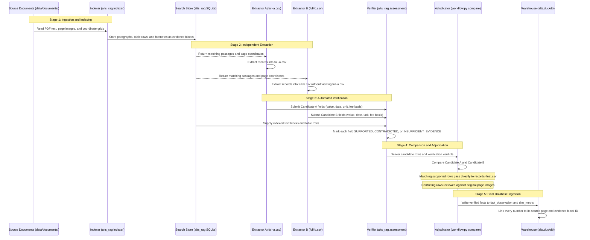
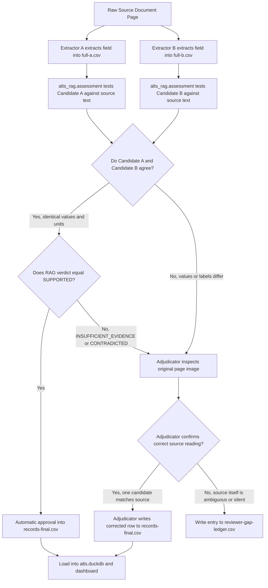

# Alts Retrieval-Augmented Generation Architecture and Information Flow

Written for Moses, who oversees this repository and requires an explanation of data flow, extracted fields, access interfaces, and the role of Extractor A and Extractor B in relation to the search and verification engine.

The Alts retrieval-augmented generation (RAG) engine searches source files and tests whether extracted investment numbers match original reports. Source reports move through text conversion, page chunking, independent extraction by two separate agents, rule-based field verification, and conflict resolution before loading into analytical databases. The phrase access interface replaces the informal term front door to name the four ways callers query the engine: command terminal, agent protocol, local web server, and static export. Extractor A and Extractor B extract data in parallel without viewing each other's work so that extraction mistakes surface immediately during comparison. The retrieval engine supplies those extractors with verbatim text passages during extraction and evaluates their output fields for correctness before final review.

## Four Access Interfaces

The phrase front door appeared in earlier notes as informal shorthand for an access interface. An access interface is an entry point through which a person or a computer program queries the system. The retrieval engine provides four distinct access interfaces, each serving a specific operating requirement:

| Access Interface | Operating Mechanism | Intended Caller | Primary Function |
|---|---|---|---|
| Command Line Interface | Terminal command `python -B -m alts_rag` | System operator | Rebuilds the search index, verifies local files, and runs offline evaluations. |
| Model Context Protocol Server | Standard input and output channel using JSON messages | Automated coding agents | Supplies search tools and evidence retrieval to language model workflows. |
| Local Web Service | Local HTTP server on `127.0.0.1:8765` | Human reviewer | Serves the interactive browser review dashboard at `rag.html`. |
| Static Demonstration Export | Precomputed file `public-demo.json` | Public web visitors | Displays verified search results in static HTML without running a live server. |

## Dual Extractor Architecture

Private fund documents contain multi-column financial tables, dense footnotes, and inconsistent terminology across different investment managers. A single person or language model reading a complex hundred-page report makes transcription mistakes, skips rows, or assigns values to the wrong columns.

The repository resolves this risk by using double-entry extraction. Two independent workers, named Extractor A and Extractor B, process the identical source document in parallel:

1. Extractor A reads the assigned document text and page images, then writes every found field to `full-a.csv`.
2. Extractor B reads the identical source document in complete isolation, without access to Extractor A's files, and writes its output to `full-b.csv`.
3. An automated comparison program reads both files side by side.
4. When Extractor A and Extractor B produce identical values, dates, and units, the record is accepted as verified.
5. When Extractor A and Extractor B disagree on a value or when one extractor misses a field, the disagreement goes to a human adjudicator for resolution.

## Extractor Integration with the Retrieval Engine

The retrieval-augmented generation engine connects to Extractor A and Extractor B at two distinct points in the extraction lifecycle:

### 1. Source Discovery During Extraction

Large fund reports often exceed one hundred pages. An extractor searching for a specific metric, such as a net internal rate of return or an unfunded commitment, queries the retrieval engine using keywords or semantic concepts. The engine returns physical page numbers, paragraph context, and table coordinates. This saves the extractor from scanning irrelevant pages.

### 2. Automated Field Verification After Extraction

Once Extractor A and Extractor B produce their candidate CSV files, the retrieval engine's assessment component evaluates each candidate row against the indexed source text.

The assessment component tests each field on its own:
- Value check: Confirms whether the printed number appears in the cited text or table row.
- Date check: Confirms whether the claimed effective date matches the date printed on that page.
- Unit check: Confirms whether the claimed currency, percentage sign, or multiple suffix matches the table column header.
- Fee basis check: Confirms whether the return is labeled gross of fees or net of fees in the surrounding text or footnotes.
- Method check: Confirms whether the calculation method matches the source description.

The engine assigns one of three statuses to each tested field:
- `SUPPORTED`: The indexed text directly confirms the extracted value, date, unit, or fee basis.
- `CONTRADICTED`: The indexed text contains a different value, date, or basis for that item.
- `INSUFFICIENT_EVIDENCE`: The indexed text does not contain enough information to confirm or reject the claim.

These automated verdicts highlight errors in Candidate A or Candidate B before the human adjudicator makes a final decision.

## Information Flow from Raw Document to Final Storage

The following sequence diagram displays how information moves between the programs, files, and reviewers from initial ingestion to final publication.

## Field Reconciliation and Decision Logic

The following flowchart displays the decision rules used when evaluating candidate fields and reconciling differences between Extractor A and Extractor B.

## Extracted Field Scope

The extraction stages record specific data fields defined across five standard record families. Every extracted record maps to one of these families:

| Record Family | Description | Core Extracted Fields |
|---|---|---|
| Document Context | Administrative identity of the filing | `subject_name`, `subject_type`, `as_of_date`, `period_start`, `period_end`, `vintage_year`, `manager_name`, `investor_name` |
| Financial Statement Observation | Balance sheet and income statement items | `metric_name`, `metric_value_raw`, `unit`, `fee_basis`, `method`, `as_of_date`, `basis_raw` |
| Performance Observation | Investment returns and risk metrics | `metric_name`, `metric_value_raw`, `unit`, `gross_net_basis`, `return_method`, `horizon`, `as_of_date` |
| Fund Economics Observation | Capital accounts and cash commitments | `commitment`, `paid_in_capital`, `distributions`, `nav`, `unfunded_commitment`, `tvpi`, `dpi`, `rvpi` |
| Stewardship and Mission | Governance, voting, and foundation metrics | `foundation_name`, `tax_year`, `category_label`, `beginning_book_value_raw`, `ending_fair_market_value_raw`, `policy_topic`, `policy_text_raw` |

### Standard Extraction Record Layout

Extractor A, Extractor B, and the adjudicator record all data in a fixed seventeen-column CSV format. Every row represents a single extracted field occurrence:

| Column Position | Column Name | Definition |
|---|---|---|
| 1 | `file_id` | Unique report identifier in the catalog. |
| 2 | `doc_type` | Document category from the routing table. |
| 3 | `lane` | Reading group designation, set to full for standard runs. |
| 4 | `record_group` | Functional family of the extracted record. |
| 5 | `record_label` | Business name grouping related fields from the same source row. |
| 6 | `record_occurrence` | Sequence counter distinguishing repeated records with identical labels. |
| 7 | `field_name` | Standardized property name from the allowed field list. |
| 8 | `value_raw` | Verbatim text or number copied directly from the page. |
| 9 | `source_page` | Physical page number in the original PDF. |
| 10 | `source_section` | Section title printed at the top of the source page. |
| 11 | `source_row_label` | Row description printed on the left side of the table. |
| 12 | `source_column_label` | Column header printed at the top of the table. |
| 13 | `evidence_quote` | One verbatim line of text from the source page backing the value. |
| 14 | `evidence_class` | Category of proof: actual, illustrative, template, requirement, or definition. |
| 15 | `source_agents` | Extractor identifiers, left blank by extractors and set by adjudicators. |
| 16 | `adjudication_status` | Status code assigned during conflict resolution. |
| 17 | `notes` | Exceptional remarks or noted schema gaps. |

## Glossary

| Term | Ordinary Meaning |
|---|---|
| Retrieval-augmented generation (RAG) | A computer process that finds relevant source passages before evaluating a question or verifying a statement. |
| Model Context Protocol (MCP) | A standard message protocol that provides artificial intelligence programs with access to external databases and tools. |
| Double-entry extraction | An audit procedure where two people or programs read the same document in isolation to detect errors by comparing outputs. |
| Internal rate of return (IRR) | An annualized percentage return calculation taking into account the size and timing of investment cash flows. |
| SQLite full-text search (FTS) | A database storage module designed for finding matching words and phrases inside text passages. |
