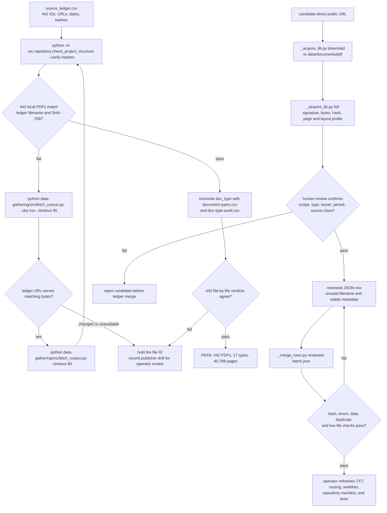

# Agent A1: corpus gathering

## Goal

Reproduce the 442-PDF source library byte for byte, or prepare a reviewed addendum of openly served source documents.

## Read set

1. `data-gathering/README.md`
2. `data-gathering/source_ledger.csv`
3. `data-gathering/document-types.md`
4. `data-gathering/src/README.md`

## Source library

| Family | Files | Visible data |
|---|---:|---|
| Financial statements | 221 | balance sheet, capital, gains, fees, expenses, holdings |
| Institutional and quarterly reports | 107 | fund rows, commitments, NAV, allocations, performance |
| Performance reports | 46 | IRR, TVPI, DPI, RVPI, return series, benchmarks |
| Schedules and statements | 40 | holdings, fees, valuations, NAV, capital activity |
| Legal and diligence documents | 19 | strategy, fees, carry, hurdle, waterfall, term, LP clauses |
| Mission and stewardship reports | 9 | foundation allocations, governance, voting, ESG measures |

## Procedure

## Addendum fields

Each accepted row carries `filename`, controlled `doc_type`, tier, issuer, issuer type, jurisdiction, period, direct source URL, retrieval date, SHA-256, layout features, redaction flag, expected field families, source class, wave, strategy, and a review note. Source class is one of `public_filing`, `freely_published`, `foia_release`, `public_domain`, or `model_template`.

## Acceptance gate

The task passes when local files and ledger rows pair 1:1, filenames and hashes are unique, every hash matches, all types use the 17-value enum, page and layout facts are populated, external drift is listed, and the repository hash check passes.

## Response cap

Return at most ten lines: accepted, rejected by reason, duplicate count, source classes, type counts, text-layer counts, pages, bytes, hash gate, and external drift.
