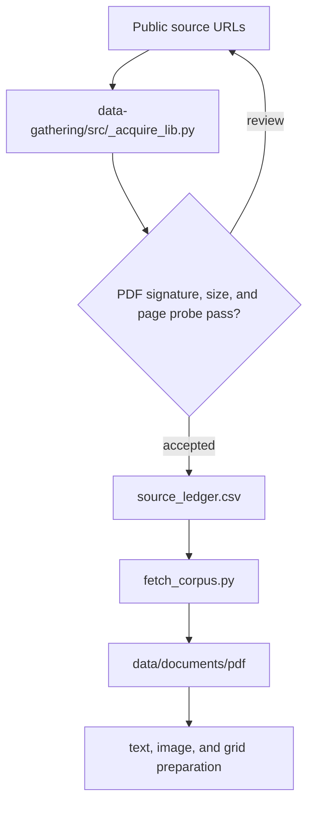

# Source acquisition

The source ledger, acquisition contract, and corpus recovery tools.

| File | Role |
|---|---|
| `source_ledger.csv` | Authoritative source ID, URL, report type, page count, and acquisition metadata. |
| `document-types.csv` | Controlled 17-value document-type list. |
| `document-types.md` | Document-family counts and visible field summary. |
| `AGENT-A1-CORPUS-GATHERING.md` | Guide for agent a1 corpus gathering. |

| Folder | Role |
|---|---|
| `src/` | Download, hash, PDF-probe, merge, and page-render utilities. |

