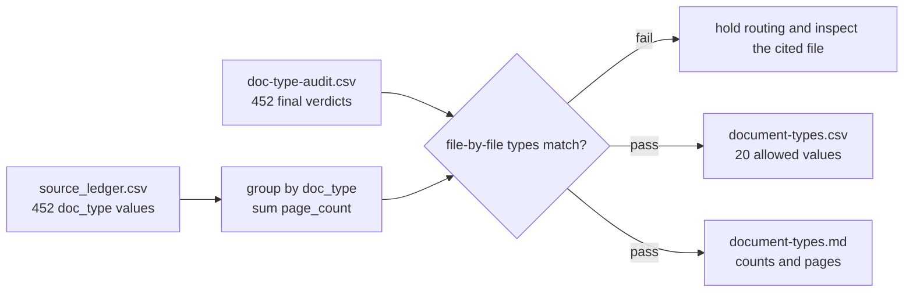

# Document types

`source_ledger.csv` and `ledgers/doc-type/doc-type-audit.csv` agree on every file.

| Type | Files | Pages | Typical visible facts |
|---|---:|---:|---|
| Financials | 221 | 24,968 | assets, liabilities, capital, gains, fees, expenses, holdings |
| Institutional_Report | 71 | 6,225 | allocations, commitments, policy, manager and portfolio schedules |
| Performance | 46 | 934 | return series, IRR, TVPI, DPI, RVPI, benchmarks |
| Quarterly_Report | 36 | 2,265 | fund rows, NAV, cash activity, performance, strategy |
| Fee_Report | 12 | 328 | management fees, carry, offsets, expenses, fee benchmarks |
| Schedule_Inv | 9 | 1,042 | issuer, instrument, cost, fair value, principal, maturity |
| PPM | 7 | 1,227 | strategy, offering terms, fees, carry, hurdle, risks |
| Cash_Flow_Notice | 6 | 58 | call or distribution amount, due date, recallable amount, fees |
| NAV_Statement | 6 | 74 | NAV, shares, NAV per share, valuation date, currency |
| Valuation | 6 | 218 | fair-value hierarchy, method, holding value, measurement date |
| Stewardship_Proxy_Report | 5 | 202 | votes, governance, stewardship activity, ESG measures |
| Secondary_Pricing | 5 | 113 | secondary volume, pricing, NAV discount, continuation activity |
| Subscription | 4 | 158 | fund, investor, class, commitment, subscription terms |
| Foundations_Annual | 4 | 2,823 | investment allocation, fair value, unfunded commitments |
| Continuation_Fund | 3 | 31 | election, roll or sell, price to NAV, fees, carry |
| DDQ | 3 | 86 | manager operations, AUM, strategy, controls, terms |
| LPA | 3 | 185 | management fee, carry, hurdle, waterfall, term, extension |
| PCAP | 3 | 7 | opening capital, contributions, distributions, gains, ending capital |
| Side_Letter | 2 | 21 | LP-specific fee, liquidity, reporting, and governance terms |
| **Total** | **452** | **40,965** | fund-level and institutional source evidence |

`Portfolio_Company_Report` is in `document-types.csv`. No PDF of that type is in the ledger yet.
