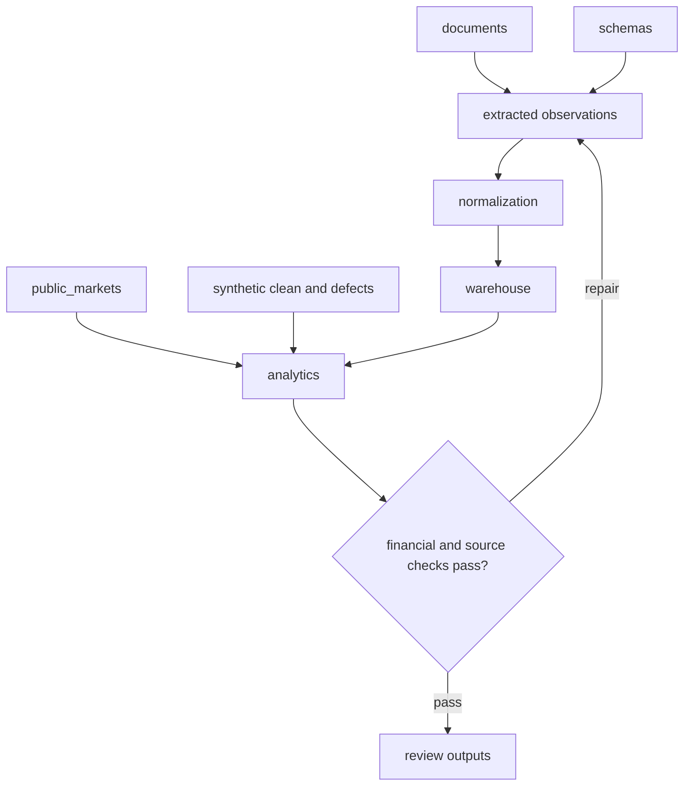

# Data layers

Source material, extracted facts, integrated outputs, market inputs, fixtures, and databases.

| Folder | Role |
|---|---|
| `csv/` | Final fund tables a reviewer can open, financial checks, and analytical results. |
| `demo/` | A two-fund example with one clean record and one planted-error record. |
| `documents/` | Local PDF sources plus text, image, and positional-grid word maps. |
| `extracted/` | Published source observations, page coverage, route consolidations, and relational tables. |
| `integrated/` | Gap, cell-lineage, reconciliation, benchmark-policy, and defect evidence for same-fund completion. |
| `normalization/` | Fund, manager, LP, plan, and company name decisions, fund-constant attributes, and open review queues retained. |
| `public_markets/` | Market and macro data selected for PME benchmarks and research extensions. |
| `schemas/` | Document routing, the 17 record families, the vocabulary of 89 metric and 30 term names, and the family surveys that define the field list. |
| `synthetic/` | Standalone generated regression fixtures that stay out of fund-model data. |
| `warehouse/` | Document evidence, final integrated fund-model data, and standalone fixture DuckDB files. |

