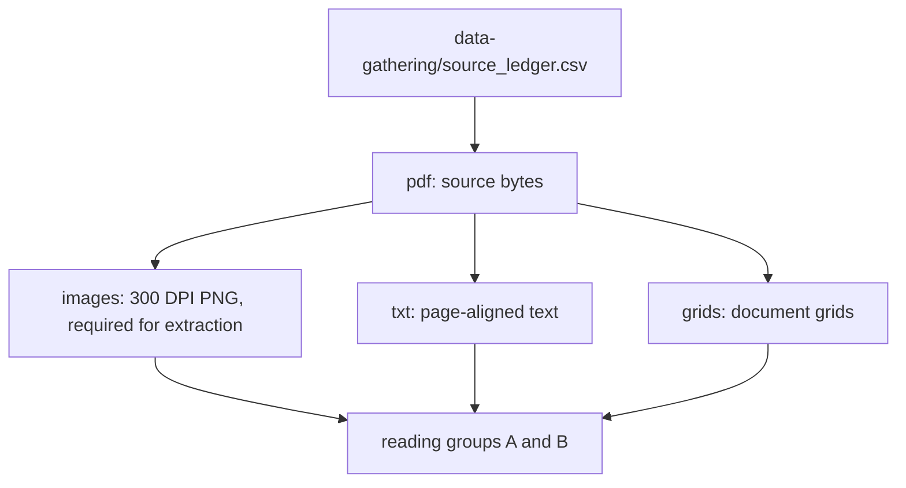

# Documents

Local PDF sources plus page text, 300 DPI pictures required for extraction, and document grids.

| Folder | Role |
|---|---|
| `grids/` | Word-position grids for the reports that were read. |
| `images/` | 300 DPI page pictures required for extraction. Git tracks the manifest. PNG files stay local because they are large. |
| `pdf/` | The 442 public and FOIA source PDFs listed in data-gathering/source_ledger.csv. |
| `txt/` | Page-aligned text derived from the source PDFs for search and quotation. |

Next: [Published extraction](../extracted/README.md).
