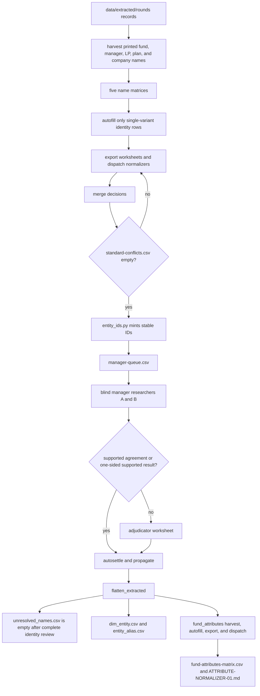

# Identity normalization

Printed names, accepted standardized identities, stable entity IDs, manager-research evidence, and closed classifications remain together here.

`src/catalog/simple_pdf_extraction/name_normalization.py` writes each identity matrix except `entity-ids.csv`. `src/catalog/simple_pdf_extraction/fund_attributes.py` writes fund-constant attributes. The commands in the third column regenerate the files; `name_normalization paths` and `fund_attributes paths` report the code-owned maps. The operator sequence is [`instructions/02-fund-mapping/00-OPERATOR-RUNBOOK.md`](../../instructions/02-fund-mapping/00-OPERATOR-RUNBOOK.md).

| File | Role | Written by |
|---|---|---|
| `fund-names-matrix.csv` | 1,055 printed fund names, fund families, stable IDs, decisions, counts, and source files | `harvest`, then `autofill` and `merge` |
| `manager-names-matrix.csv` | Managers printed directly in the extracted sources | `harvest`, `autofill`, `merge` |
| `lp-names-matrix.csv` | Limited-partner name standards | `harvest`, `autofill`, `merge` |
| `plan-names-matrix.csv` | Pension and institutional-plan name standards | `harvest`, `autofill`, `merge` |
| `company-names-matrix.csv` | Portfolio-company name standards | `harvest`, `autofill`, `merge` |
| `entity-ids.csv` | Append-only registry for fund, manager, LP, plan, and company IDs | `instructions/02-fund-mapping/entity_ids.py` |
| `manager-queue.csv` | Independent manager-search work and final decisions by sponsor family | `manager-queue`, then `manager-merge` and `manager-autosettle` |
| `web-manager-names.csv` | Fund-to-manager research result and supporting public sources | `propagate`, reported by `managers` |
| `web-manager-names-matrix.csv` | Standardized manager names derived from the web research round | `harvest`, `merge` |
| `fund-attributes-matrix.csv` | One row per fund with printed vintage, strategy, asset class, and geography, plus unique, spelling-collapsed, conflict, and decided statuses | `python -m src.catalog.simple_pdf_extraction.fund_attributes harvest`, then `autofill`, `merge`, and `apply` |
| `attribute-conflicts.csv` | Funds whose remaining printed labels still disagree after hyphen and `Investments`-suffix collapse. Header-only is the passing result of `fund_attributes conflicts --strict` | `conflicts` |
| `name-near-duplicates.csv` | Similar spellings presented for review without automatic merging | `check` |
| `standard-conflicts.csv` | Cases where one normalization key points to more than one standard. Header-only, and that is the passing result of `conflicts --strict` | `conflicts` |
| `worksheets/` | Human normalization, blind manager search, adjudication slices, and attribute-conflict rows | `export`, `manager-export`, and `fund_attributes export` |

Only standardized and source-supported rows receive entity links. Negative manager searches carry a stated no-public-match result, and source-silent manager fields remain blank with a stated reason. Fund-constant attributes copy a printed heading across tables and documents for the same fund; they do not invent a vintage or strategy the corpus never printed.

Fund-level output: [`../extracted/fund-level/README.md`](../extracted/fund-level/README.md).
