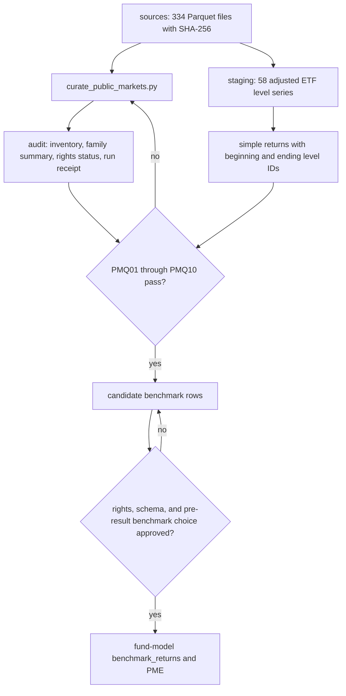

# Public-market inputs

This package supplies dated comparison series for PME and compact market, macro, volatility, positioning, liquidity, and real-asset research inputs.

| Folder | Contents |
|---|---|
| `sources/` | 334 hash-checked Parquet files, the input `curate_public_markets.py` reads |
| `staging/` | Candidate benchmark master, levels, returns, and strategy map |
| `audit/` | File inventory, series-family summary, ten quality checks, and the run receipt |

All retained sources carry `DEMONSTRATION_ONLY` rights status and `DEMO_PROXY_ONLY` use. ETF proxies are not substitutes for a licensed institutional index. Each file keeps the folders of the acquiring corpus inside its name, joined by a double underscore, and the inventory records that path with the SHA-256, schema, and date range.
