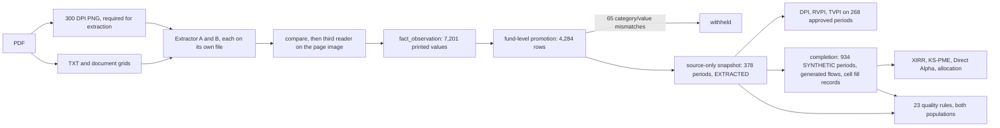

# Layers

| Layer | Owner | Main output |
|---|---|---|
| Source | PDF reports and source catalog | `data/documents/` |
| Extraction | 300 DPI PNG per page, then A/B candidates, each on its own file, and the third reader | `data/extracted/rounds/` |
| Evidence | Printed cells and A/B origin records | `data/extracted/tables/`, `extracted.duckdb` |
| Identity | Reviewed entity and attribute matrices | `data/normalization/` |
| Fund-level promotion | Source-backed rows written by `promote_extracted_to_fund_level`, checked by `validate_round02_promotion` | `data/extracted/fund-level/` (copy taken before fill) |
| Completion | Extracted-first completion with a label and a fill record per cell | `data/csv/`, `data/integrated/` |
| Quality and analytics | 23 rules, then multiples, XIRR, PME, and allocation, each row copying its input period's origin mark | `data/csv/quality_results.csv`, `fund_metrics.csv`, `pme_results.csv`, `portfolio_allocations.csv` |
| Review | Flat observations, periods, gaps, fill records, and the dashboard | `data/extracted/review/`, `dashboard.html` |
| Query | Copies of the CSV layers with the same rows and values | `extracted.duckdb`, `alts.duckdb` |
| Fixture | A separate 800-fund population for rule and generator tests | `data/synthetic/`, `alts_mock.duckdb` |
| History | Readable transformation receipts; large backups stay local | `ledgers/pipeline/`, sibling artifact archive |

The analytics path reads `data/csv/` alone. The regression fixture under `data/synthetic/` goes into `alts_mock.duckdb` and nothing else.

Next: [`FINAL-RELEASE-AUDIT.md`](FINAL-RELEASE-AUDIT.md).
