# Fund tables

The tables below define the fund-level schema in `config/fund_level_schema.yml`. The CSVs in `data/csv/` are the owner; `data/warehouse/alts.duckdb` is loaded from them by `sql/duckdb/02_fund_level_ddl.sql` and checked so it matches those files. The DDL declares primary keys, required columns, and value checks; the relationships drawn below are enforced by the release checks (`python -m src.pipeline.reviewer_check`), not by database foreign keys, because each table is rebuilt from its own CSV. `document_entity_context` and `entity_registry` are working CSVs beside the model and are not loaded into the warehouse. The labelled mock population in `data/synthetic/` uses the same table shapes.

The analytical unit is the named fund, not its manager. Manager, LP position, share class, holding, date, currency, perspective, and source location remain separate dimensions of each fact.

```mermaid
erDiagram
    MANAGER_MASTER ||--o{ FUND_MASTER : manages
    MANAGER_MASTER ||--o{ MANAGER_OBSERVATIONS : has
    MANAGER_MASTER ||--o{ DOCUMENT_MANAGER_MAP : named_in
    FUND_MASTER ||--o{ DOCUMENT_FUND_MAP : named_in
    FUND_MASTER ||--o{ FUND_OBSERVATIONS : reports
    FUND_MASTER ||--o{ FUND_CASHFLOWS : receives
    FUND_MASTER ||--o{ FUND_PERIODS : summarizes
    FUND_MASTER ||--o{ FUND_TERMS : governed_by
    FUND_TERMS ||--o{ FUND_TERM_CLAUSES : qualified_by
    FUND_MASTER ||--o{ FUND_HOLDINGS : owns
    FUND_MASTER ||--o{ QUALITY_RESULTS : checked_by
    FUND_MASTER ||--o{ FUND_METRICS : analyzed_by
    FUND_MASTER ||--o{ PME_RESULTS : compared_by
    FUND_MASTER ||--o{ PORTFOLIO_ALLOCATIONS : allocated_to
    BENCHMARK_RETURNS ||--o{ PME_RESULTS : supplies
    SYNTHETIC_PARAMETERS ||--o{ DEFECT_INJECTIONS : controls
    SYNTHETIC_PARAMETERS ||--o{ FUND_MASTER : generates

    MANAGER_MASTER {
        string manager_id PK
        string manager_name
        string provenance_type
    }
    FUND_MASTER {
        string fund_id PK
        string fund_manager_id FK
        string fund_name
        int vintage_year
        decimal fund_size
        string strategy
        string provenance_type
    }
    DOCUMENT_FUND_MAP {
        string document_fund_map_id PK
        string file_id
        string fund_id FK
        string fund_name_raw
        string perspective
        int source_page
    }
    DOCUMENT_MANAGER_MAP {
        string document_manager_map_id PK
        string file_id
        string manager_id FK
        string manager_name_raw
        int source_page
    }
    FUND_OBSERVATIONS {
        string observation_id PK
        string fund_id FK
        string metric_id
        string date_role
        decimal value_numeric
        string perspective
        int source_page
    }
    MANAGER_OBSERVATIONS {
        string manager_observation_id PK
        string manager_id FK
        string metric_id
        decimal value_numeric
        int source_page
    }
    FUND_CASHFLOWS {
        string cashflow_id PK
        string fund_id FK
        date cashflow_date
        string cashflow_type
        decimal amount
    }
    FUND_PERIODS {
        string fund_period_id PK
        string fund_id FK
        date as_of_date
        decimal paid_in_capital_itd
        decimal distributions_itd
        decimal nav
        decimal dpi
        decimal rvpi
        decimal tvpi
        string provenance_type
    }
    FUND_TERMS {
        string fund_term_id PK
        string fund_id FK
        string term_scope
        decimal management_fee_rate
        decimal carry_rate
        decimal hurdle_rate
    }
    FUND_TERM_CLAUSES {
        string fund_term_clause_id PK
        string fund_id FK
        string overrides_fund_term_id FK
        string metric_id
        string value_raw
    }
    FUND_HOLDINGS {
        string holding_id PK
        string fund_id FK
        string portfolio_company_id
        date as_of_date
        decimal cost
        decimal fair_value
    }
    SYNTHETIC_PARAMETERS {
        string parameter_id PK
        string parameter_set_id
        string parameter_name
        decimal value_numeric
        boolean active
    }
    DEFECT_INJECTIONS {
        string defect_id PK
        string parameter_set_id FK
        string fund_id FK
        string expected_rule_id
    }
    QUALITY_RESULTS {
        string quality_result_id PK
        string fund_id FK
        string rule_id
        string status
    }
    BENCHMARK_RETURNS {
        string benchmark_return_id PK
        string benchmark_id
        date return_date
        decimal return_value
    }
    FUND_METRICS {
        string analysis_result_id PK
        string entity_id FK
        string metric_id
        decimal value_numeric
        string formula_id
        string provenance_type
    }
    PME_RESULTS {
        string analysis_result_id PK
        string entity_id FK
        string benchmark_id FK
        string metric_id
        decimal value_numeric
        string provenance_type
    }
    PORTFOLIO_ALLOCATIONS {
        string allocation_id PK
        string portfolio_id
        string fund_id FK
        decimal target_weight
        string optimization_run_id
    }
```

| Table group | CSV field lists |
|---|---|
| Identity and document context | `manager_master`, `fund_master`, `document_fund_map`, `document_manager_map`, `document_entity_context`, `entity_registry` |
| Source and period facts | `fund_observations`, `manager_observations`, `fund_cashflows`, `fund_periods`, `fund_terms`, `fund_term_clauses`, `fund_holdings` |
| Generation and control | `synthetic_parameters`, `defect_injections`, `quality_results` |
| Market and analysis | `benchmark_returns`, `fund_metrics`, `pme_results`, `portfolio_allocations` |

`fund_master` and `fund_periods` receive `vintage_year` and `strategy` from `data/normalization/fund-attributes-matrix.csv` when that fund has a unique printed value. Printed observation columns stay as the page printed them. Every generated cell is recorded in `data/integrated/cell-lineage.csv` with its formula, its parameter set (`synthetic_parameter_set_id`, declared in `synthetic_parameters`), and the printed records it was completed from.

| Financial identity | Check |
|---|---|
| DPI | distributions divided by paid-in capital |
| RVPI | NAV divided by paid-in capital |
| TVPI | DPI plus RVPI |
| Commitment | paid-in capital plus unfunded commitment minus recallable distributions |
| NAV rollforward | beginning NAV plus contributions, gains, and income minus distributions, fees, and expenses equals ending NAV |
| IRR | recomputed from dated economic cash flows plus terminal NAV |

Reported and calculated values occupy separate records. A source blank, printed zero, inapplicable field, and missing field remain different states.
