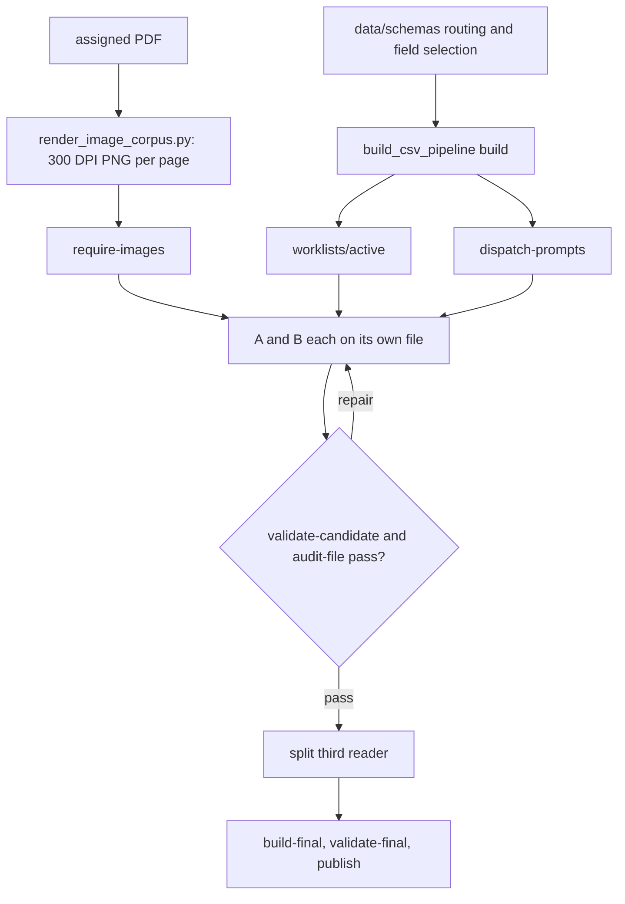

# PDF extraction and source review

Independent extraction and source review retain printed values, definitions, table context, and page evidence; shared candidate and final checks reject omissions and contradictory interpretations.

| File | Role |
|---|---|
| `00-OPERATOR-RUNBOOK.md` | The operator's command sequence for this stage, with its checks and rerun rules. |
| `FIELD-SELECTION.csv` | One row per document type and record family: grain, category kind, required and allowed fields, and the family's usual vocabulary names. |
| `CSV-TEMPLATE.csv` | The record columns, in order: the header every records-a, records-b, and records-final file must carry. Header-only by design: a template is its header. |
| `COVERAGE-TEMPLATE.csv` | The 15 coverage columns: the header every coverage-a, coverage-b, and coverage-final file must carry. Header-only by design: a template is its header. |
| `RESOLUTION-TEMPLATE.csv` | Pair identifier, decision and reason followed by the complete reviewed record columns. Header-only by design: a template is its header. |
| `COVERAGE-RESOLUTION-TEMPLATE.csv` | The four columns a third reader writes to decide a page whose two coverage rows disagree. Header-only by design: a template is its header. |
| `BATCH-WORKLIST-TEMPLATE.csv` | The 16 worklist columns: what a route assignment names about each source and its page text, pictures, and word maps. Header-only by design: a template is its header. |
| `workflow.py` | Command-line entry to csv_workflow: require-images, claim, validate-candidate, audit-file, compare, build-final, validate-final, status, and publish. |

| Folder | Role |
|---|---|
| `dispatch-prompts/` | Generated role briefs grouped by source-report route. |
| `worklists/` | Source assignments split into active, deferred, and reference scopes. |

Next: [Fund identity and manager mapping](../02-fund-mapping/README.md).
