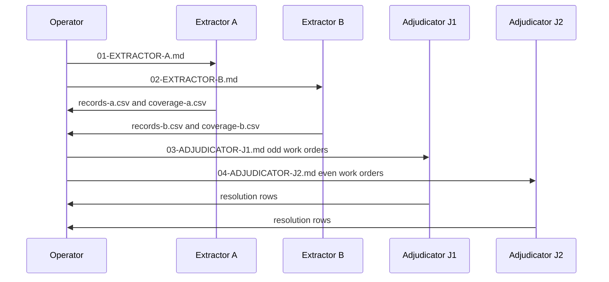

# Route 03-institutional-report briefs

Generated extractor and adjudicator briefs for route 03-institutional-report, one file per role; rebuilt by build_csv_pipeline.

| File | Role |
|---|---|
| `01-EXTRACTOR-A.md` | Extractor A, on its own file: reads the route's documents through TXT, grid, and page image, writes records-a.csv and coverage-a.csv, and runs validate-candidate and audit-file per document. |
| `02-EXTRACTOR-B.md` | Extractor B: the same brief as A, differing in reading-group name and output paths only, so the two reading groups are comparable. |
| `03-ADJUDICATOR-J1.md` | Third reader for odd work orders: repairs pairing and number-format errors, runs compare, picks every pair against the page image, and builds the final file. |
| `04-ADJUDICATOR-J2.md` | Third reader for even work orders: the same brief as J1 on the other half of the route. |

