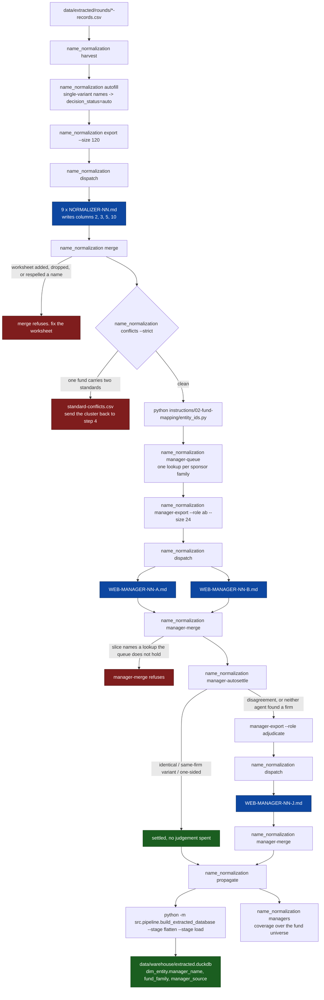
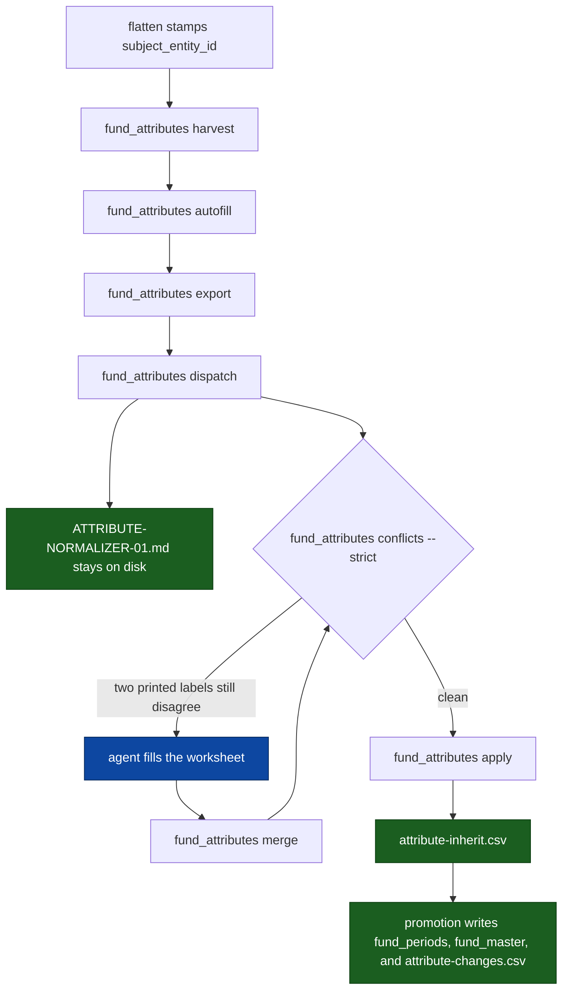

# Identity: operator runbook

The operator runs the mechanical commands. Agents run the three judgement steps, from
prompts this repo generates. Nothing here needs a conversation to reproduce.

This folder is instructions. The matrices, worksheets, work order, and queues are
data, under `data/normalization/`; its README maps every step to the file it
reads and the file it writes.

## Dispatch

Prompts are generated, never hand-written, because the slices decide how many
agents there are: a different corpus produces a different number of files.

```powershell
python -m src.catalog.simple_pdf_extraction.name_normalization dispatch
python -m src.catalog.simple_pdf_extraction.name_normalization dispatch --check
```

`dispatch` writes one self-contained prompt per worksheet under `dispatch-prompts/`
and keeps it after the slice is settled. A prompt is removed only when its
worksheet is gone. `--check` writes nothing and fails if a prompt on disk no
longer matches its brief or its slice. Remaining work is the slice line on the
prompt, not an empty folder.

A row counts as finished when the agent has answered it, not when it holds a
value. A normalizer row is finished at `decided` or `review`, never at `auto`,
which is a machine proposal nobody has read. A search row is finished once it
carries a source, including `WEB_MANAGER: unresolved`: a lookup both lanes
answered with nothing published is answered, and re-issuing it spends the search
again on the same dead end.

To deliberately search an answered lookup a second time, against a source the
first pass did not use:

```powershell
python -m src.catalog.simple_pdf_extraction.name_normalization manager-export --role ab --retry
python -m src.catalog.simple_pdf_extraction.name_normalization dispatch
```

`--retry` exports those lookups with empty answer cells, so the searcher is not
reading the previous verdict before forming its own. The work order keeps the
first answer until `manager-merge` folds the new one over it.

| Folder | One prompt per | Launch after |
|---|---|---|
| `dispatch-prompts/normalize/` | `worksheets/fund-part-NN.csv` (kept after the slice is settled) | `export` |
| `dispatch-prompts/web-manager/` | `worksheets/manager-NN-a.csv` and `-b.csv` (kept after the slice is settled) | `manager-export --role ab` |
| `dispatch-prompts/adjudicate/` | `worksheets/manager-NN-j.csv` (kept after the slice is settled) | `manager-export --role adjudicate` |
| `dispatch-prompts/attributes/` | `worksheets/attribute-conflicts.csv` (kept after the slice is settled) | `fund_attributes export` |

Paste one prompt per agent. Each names its own file, its own row count, and the
resume rule; they are blind to each other and share no file. `A` and `B` for one
slice must be different sessions, or the second search is not independent.

## The order



## Output locations

Every matrix, queue, and worksheet lands under `data/normalization/`. Nothing in
this stage writes into this instructions folder except `dispatch`, which
generates the agent prompts. The table is the `WRITES` registry in
`name_normalization.py`; `name_normalization paths` prints it, and
`tests/test_name_normalization_paths.py` fails if the two disagree or if a
command is added without an entry.

| Command | Writes |
|---|---|
| `harvest` | `data/normalization/fund-names-matrix.csv` and the manager, LP, plan, and company matrices beside it |
| `autofill` | `data/normalization/<kind>-names-matrix.csv` |
| `check` | `data/normalization/name-near-duplicates.csv` |
| `conflicts` | `data/normalization/standard-conflicts.csv` |
| `export` | `data/normalization/worksheets/fund-part-NN.csv` |
| `merge` | `data/normalization/<kind>-names-matrix.csv` |
| `manager-queue` | `data/normalization/manager-queue.csv` |
| `manager-export` | `data/normalization/worksheets/manager-NN-<role>.csv` |
| `manager-merge` | `data/normalization/manager-queue.csv` |
| `manager-autosettle` | `data/normalization/manager-queue.csv` |
| `propagate` | `data/normalization/web-manager-names.csv` |
| `managers` | `data/normalization/web-manager-names.csv` |
| `dispatch` | `instructions/02-fund-mapping/dispatch-prompts/<role>/` |
| `batches`, `families`, `paths` | prints a report; writes nothing |

`entity_ids.py`, run separately after `conflicts --strict` passes, writes
`data/normalization/entity-ids.csv` and appends only; an ID is never reused or
renumbered.

## Verify

```powershell
python -m src.catalog.simple_pdf_extraction.name_normalization paths
python -m src.catalog.simple_pdf_extraction.name_normalization dispatch --check
python -m src.catalog.simple_pdf_extraction.name_normalization conflicts --strict
python -m src.catalog.simple_pdf_extraction.name_normalization managers
python -m pytest tests/test_name_normalization_managers.py tests/test_flatten_extracted.py
```

`managers` is the coverage report and counts only the settled fund universe.
Rows for names since merged away or sent back to `review` are reported apart and
never counted, so the percentage always has the same denominator.

`propagate` carries a lookup's result to every fund it covers whether or not a
firm was found. A fund searched with nothing published keeps the searchers'
evidence and an empty manager, which is why `searched, no firm found` and
`waiting for the web round` are different lines in the report.

## Re-running against a different extraction

Publish the rounds, then run the order above from `harvest`. Every command is
idempotent: `harvest` appends only names it has not seen, `manager-queue`
carries settled answers forward, and `dispatch` regenerates the prompts to match
whatever slices exist at that point. Nothing needs to be edited by hand, and no step
depends on a previous run's chat.

The command output and generated worksheet rows record the current run state.

## Fund-constant attributes

Vintage, strategy, asset class, and geography are constant for a fund. Extractors
already copy a grouping heading onto every row of that page. Blanks that remain
sit on another table in the same document, or on another document that never
printed the heading. This stage copies a printed value across those rows at fund
grain after flatten has stamped `entity_id`.

It does not edit adjudicated extraction files. Printed context columns on
`fact_observation` stay as the page printed them. A fund the corpus never labelled
stays blank. `apply` writes an inherit log of the observation cells that would
fill. Promotion owns fund-model table writes and records each changed cell.



`dispatch` writes `ATTRIBUTE-NORMALIZER-01.md` under `dispatch-prompts/attributes/`
and keeps it after every split is settled. That file is a process artifact, the
same class as the extraction route briefs: regenerate it so it matches the
current worksheet, do not delete it when the worksheet is header-only.

```powershell
python -m src.catalog.simple_pdf_extraction.fund_attributes harvest
python -m src.catalog.simple_pdf_extraction.fund_attributes autofill
python -m src.catalog.simple_pdf_extraction.fund_attributes export
python -m src.catalog.simple_pdf_extraction.fund_attributes dispatch
python -m src.catalog.simple_pdf_extraction.fund_attributes merge
python -m src.catalog.simple_pdf_extraction.fund_attributes conflicts --strict
python -m src.catalog.simple_pdf_extraction.fund_attributes apply
python -m src.catalog.simple_pdf_extraction.fund_attributes paths
python -m src.catalog.simple_pdf_extraction.fund_attributes dispatch --check
```

`conflicts --strict` is the gate: unique and hyphen-collapsed spellings are already
settled by `harvest`. Agents see only the remainder. Promotion fills blank
fund-model cells and writes their source evidence to `attribute-changes.csv`.

| Command | Writes |
|---|---|
| `harvest` | `data/normalization/fund-attributes-matrix.csv` |
| `autofill` | `data/normalization/fund-attributes-matrix.csv` |
| `conflicts` | `data/normalization/attribute-conflicts.csv` |
| `export` | `data/normalization/worksheets/attribute-conflicts.csv` |
| `merge` | `data/normalization/fund-attributes-matrix.csv` |
| `dispatch` | `instructions/02-fund-mapping/dispatch-prompts/attributes/` |
| `apply` | `data/extracted/audit/attribute-inherit.csv` |
| `paths` | prints a report; writes nothing |
