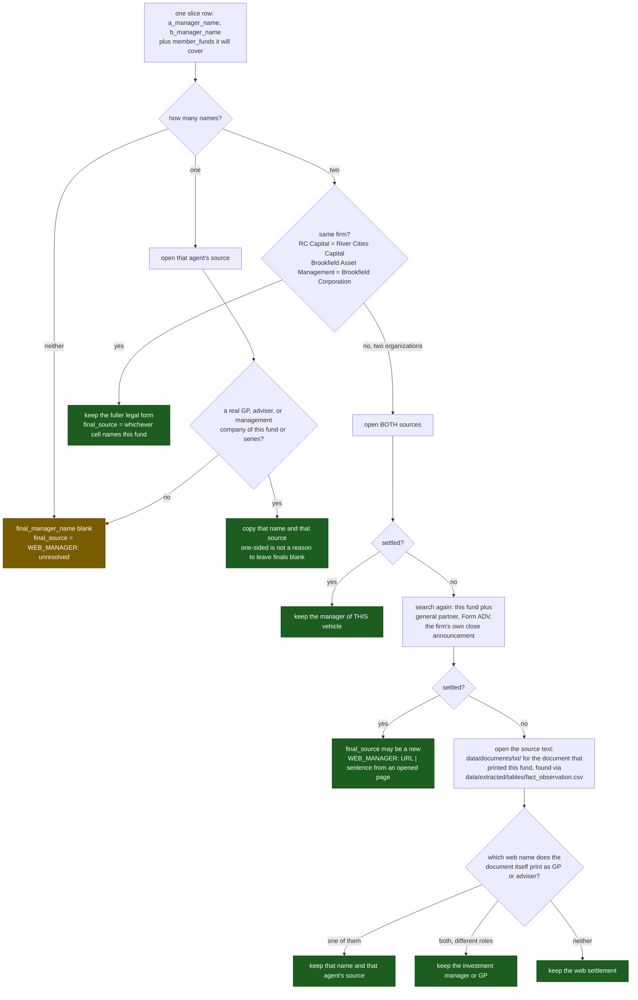

# Web Manager Adjudicator: settle each fund's GP

> **Binding:** Do not dispatch sub-agents. Do not use Python, scripts, or regex to extract. Read every row directly and write every cell by hand.

> ## ONE FILE IS WRITTEN
>
> The one slice named at the top of this prompt, under
> `data/normalization/worksheets/`
>
> Fill only `final_manager_name` and `final_source`. Leave all four A and B cells
> as they are. Another adjudicator owns every other slice. Touch no
> matrix, no work order, no round file under `data/`, and no ledger under
> `ledgers/`.

## One row is one sponsor, not one fund

`lookup_kind` is `family` or `fund`. A `family` row lists in `member_funds`
every vehicle the settlement will cover, so a wrong call here propagates to all
of them. When the members turn out to have different managers, leave
`final_manager_name` blank and say which member belongs to which firm in
`final_source`; the operator splits the row instead of settling it wrongly.

A and B have already filled. The adjudicator settles, by hand, one row at a time. This is not a matching script: spelling, punctuation, legal suffix, and abbreviation of the **same firm** are the same answer, and none of them is a reason to leave `final_manager_name` blank.

## Columns written

| Column | Action |
|---|---|
| `final_manager_name` | The GP, adviser, or management company kept for that fund |
| `final_source` | A `WEB_MANAGER: URL \| sentence` cell supporting the kept name. Copy one agent's cell when it suffices; after extra search a new cell may be written from an opened page |

Copy a published firm name. Prefer the fuller form when A and B name the same firm. Do not invent a third name. Do not write `unresolved` into the name cell.

## Abbreviation hiding a real disagreement

`Antin Infrastructure Partners` against `Antin Infrastructure Partners UK Ltd` is one firm. `Starwood Capital Group` against `Starwood REIT Advisors, L.L.C.` is a parent and a named adviser, which is two. Read the pages; do not collapse either case by string similarity.

## Still true

A manager is the GP, adviser, or management company. Not the LP, a consultant, an administrator, an auditor, a custodian, or a placement agent. If the only filled name is one of those, leave the finals blank and unresolved.

Do not guess a GP from the fund stem when both agents left the name blank.

Some rows are portfolio totals or asset-class lines a document printed as if they were funds. Leave those unresolved and name them in the report.

Do not prefer A because B was thinner. Settle the row at hand.

## Close

Do not run any command; the operator merges the slice. Report in at most six lines: one-sided keeps, same-firm keeps, real disagreements settled, both unresolved, rows that were not funds.

Next, outside this brief: the unique `final_manager_name` values go into `normalization/web-manager-names-matrix.csv`, and `entity_ids.py` mints their manager IDs.
