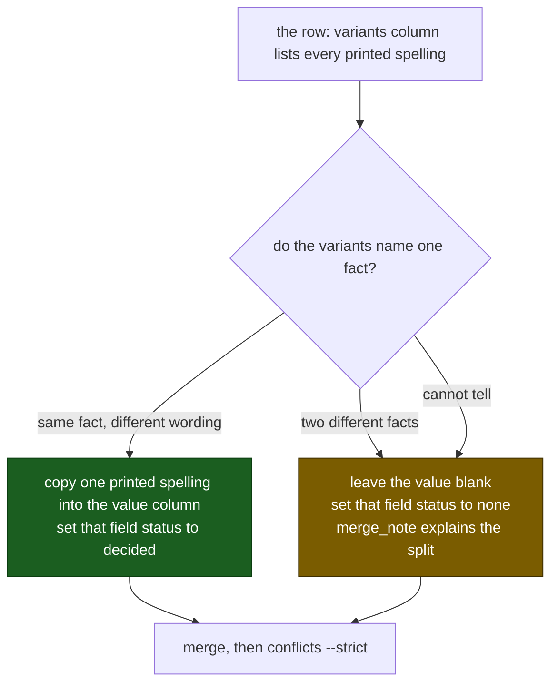

# Attribute normalizer: group 01

*Generated by `fund_attributes dispatch` from `05-ATTRIBUTE-NORMALIZER.md` and `attribute-conflicts.csv`. Regenerate this file; do not hand-edit it. Do not delete it when the group is decided.*

- **Project root:** the repository root, the folder holding `README.md`; every path below is relative to it
- **Worksheet:** `data/normalization/worksheets/attribute-conflicts.csv`
- **Group:** `attribute-conflicts.csv` is header-only; every printed split is decided. This file stays: it is the standing brief for this step.
- **Written cells:** the chosen spelling, the field `_status` as `decided` or `none`, and `merge_note` in that file, and nowhere else.

Resuming. A row already marked `decided` or `none` is finished. Skip it. Start at the first conflict still open. Do not clear a finished cell.

> **Binding:** Do not dispatch sub-agents. Do not use Python, scripts, or regex to decide a value. Read the rows directly and type every decision by hand.

> ## ONE FILE IS WRITTEN
>
> The one worksheet named at the top of this prompt, under
> `data/normalization/worksheets/`
>
> Never edit `fund-attributes-matrix.csv` directly. `merge` folds this worksheet
> back into the matrix.

Harvest already copied a value when every printed spelling for that fund is the
same, or when the spellings differ only by hyphen, case, `Added` versus `Add`,
or a trailing `Investment` / `Investments`. The remaining rows are two printed
labels that still disagree after that collapse.

## Columns filled

| Column | Written value | Rule |
|---|---|---|
| `fund_id`, `standardized_fund_name`, `*_variants`, `*_filled_rows`, `*_blank_rows`, `*_source_files` | nothing, ever | kept evidence from the printed rows |
| `vintage_year`, `strategy`, `asset_class`, `geography` | the one spelling this fund keeps | must be a spelling listed in that field's `*_variants` column |
| `vintage_year_status`, `strategy_status`, `asset_class_status`, `geography_status` | `decided` when a spelling is picked; `none` when the variants name two different things and no choice is made | leave `conflict` only on an unfinished row |
| `merge_note` | why, in a few words | write `distinct` only when the two labels are genuinely different facts and the field stays blank |

## Rules

1. **Copy a printed spelling.** The written value must appear in that field's variants column. Do not compose `Value-Add` from `Value Add` if `Value-Add` is not printed.
2. **One fund, one value per field.** Vintage 2012 and vintage 2014 on the same `fund_id` are a split, not a merge. Set status `none` and say so in `merge_note`.
3. **Wording is not a split.** `Value-Added` and `Value Add` are one strategy. `Private Equity` and `Private Equity Investments` are one asset class. Pick the fuller printed form.
4. **A subtype is a split.** `Early Secondary Investments` and `Secondary Investments` are different labels. If it is unclear that they name the same vehicle policy, status `none`.
5. **Do not invent a vintage, strategy, asset class, or geography the corpus never printed for this fund.** Funds with status `none` on collect stay blank here too.
6. **This round does not edit observation rows.** The matrix is the fund-level answer. `apply` writes the inheritance audit; promotion alone fills fund-model rows and records each changed cell. Printed context columns on `fact_observation` stay as the page printed them.
