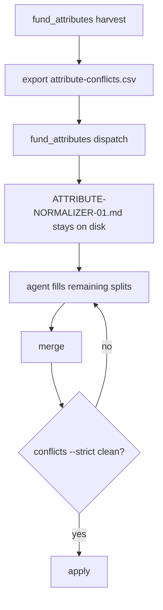

# Attributes

Standing generated brief for fund-constant attribute spelling splits; kept after the worksheet is header-only.

| File | Role |
|---|---|
| `ATTRIBUTE-NORMALIZER-01.md` | Standing pasteable brief for the fund-constant attribute worksheet; regenerated by fund_attributes dispatch, kept after the slice is settled. |

