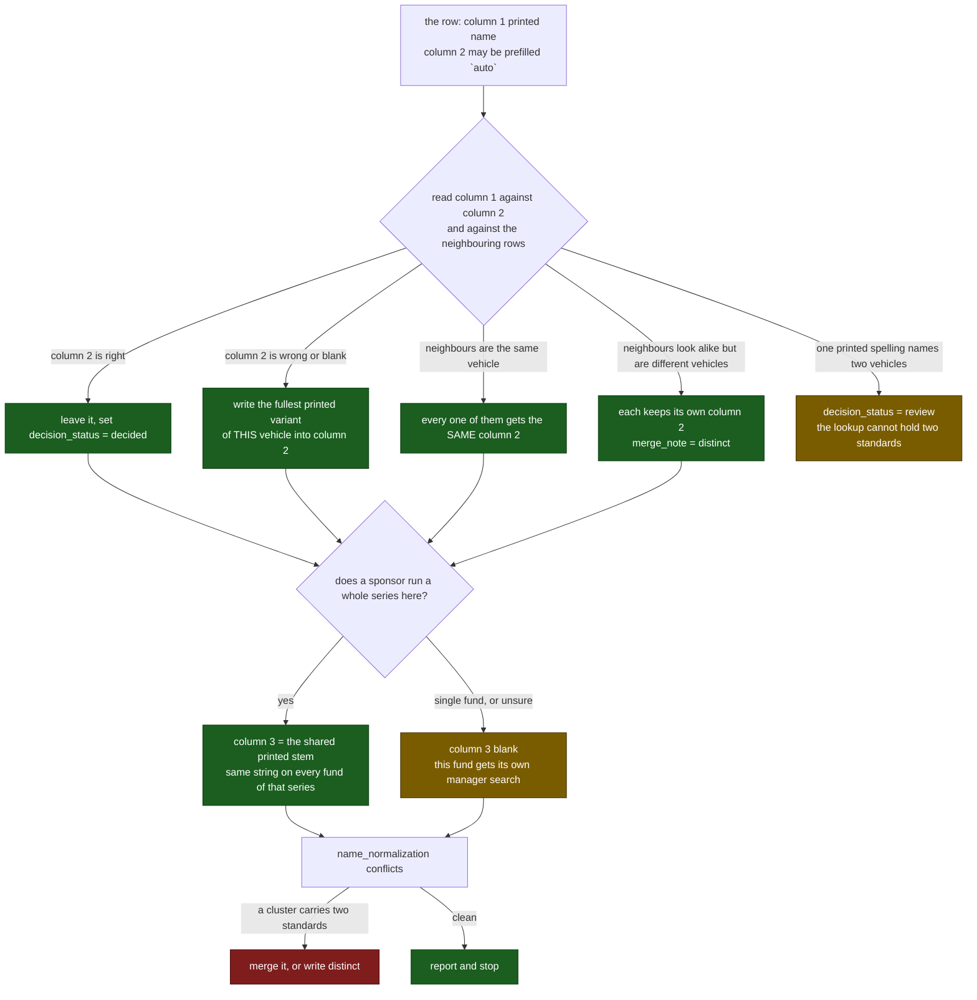

# Name normalizer: slice 05

*Generated by `name_normalization dispatch` from `01-NAME-NORMALIZER.md` and `fund-part-05.csv`. Regenerate this file; do not hand-edit it. Do not delete it when the slice is settled.*

- **Project root:** the repository root, the folder holding `README.md`; every path below is relative to it
- **Worksheet:** `data/normalization/worksheets/fund-part-05.csv`
- **Slice:** 119 printed fund names; 119 already finished in an earlier session. Every row is finished. This file stays: it is the standing brief for this slice.
- **Written cells:** `standardized_fund_name`, `fund_family`, `decision_status`, `merge_note` in that file, and nothing else anywhere.

**Resuming.** A row whose cells are already filled is finished work, from an earlier session or an earlier attempt at this slice. Skip it, start at the first empty row, and never clear or rewrite a filled cell. Sessions do fail part way through, and the only thing that loses work is starting over.

> **Binding:** Do not dispatch sub-agents. Do not use Python, scripts, or regex to decide a name. Read the rows directly and type every decision by hand.

> ## ONE FILE IS WRITTEN
>
> The one worksheet named at the top of this prompt, under
> `data/normalization/worksheets/`
>
> Another normalizer owns every other worksheet, and `merge` folds them all back
> into `fund-names-matrix.csv` afterwards. Never edit the matrix directly:
> nine normalizers writing one file overwrite each other silently.

Rows are sorted by `fund_name_raw`, so variants of one fund sit next to each
other and the worksheet holds whole clusters. A cluster split across the seam
between two worksheets is settled by `conflicts`, not by reaching into the
neighbouring file.

## Columns filled

| Column | Written value | Rule |
|---|---|---|
| 1 `fund_name_raw` | nothing, ever | frozen; it is what the document printed |
| 2 `standardized_fund_name` | the fund's one standard name | must be a spelling that appears in column 1 somewhere in this file |
| 3 `fund_family` | the sponsor series this fund belongs to | a search key, blank when unsure |
| 5 `decision_status` | `decided`, or `review` | leave `auto` rows only when they are correct |
| 10 `merge_note` | why, in a few words | write `distinct` when look-alikes are genuinely different vehicles |

Never type `fund_id`. `entity_ids.py` mints it.

## Column 2, the standardized name

1. **One raw spelling, one standard.** One-to-one lookup.
2. **The standard must be an observed variant.** Pick the fullest printed legal form among that vehicle's variants. Do not compose `L.P.` onto a name no document printed.
3. **Merge only the same vehicle.** Case, punctuation, `Inc.`, and `L.P.` against `LP` may merge. `META PLATFORMS INC` and `Meta Platforms` are one company.
4. **Never merge different series.** Fund IV, V, and VI stay three standards. `Fund II` and `Fund II-A` are two vehicles. Write `distinct` in `merge_note` so the conflict check stops asking.
5. **Do not repair OCR into an unobserved spelling.** If the document prints `HERITAGE PARTNERS.INC`, that string is the standard unless a fuller printed form exists in the file.
6. **A prefilled `auto` value is a proposal, not an answer.** It was set mechanically because no other row shared its shape. Read it against column 1 and against its neighbours, then keep or correct it.
7. **When one printed spelling names two different vehicles, write `review`.**

## Column 3, the fund family

A general partner runs a whole series, so naming the family lets the manager round search once for `Lone Star` instead of fourteen times for fourteen Lone Star vehicles.

The family is the shared printed stem, copied from the fund names themselves: `Lone Star Fund VIII (U.S.), L.P.` and `Lone Star Real Estate Fund II (U.S.), L.P.` both get `Lone Star`. Use the same string, character for character, on every member.

Three things keep this safe:

**The family is a search key, not a claim.** It says "look these up together", never "this firm runs them". The web round names the GP and cites a page for it. A slightly wrong family costs one extra search; it cannot put a wrong manager into the data.

**Blank is always allowed.** A fund with no obvious siblings, or any uncertain case, gets a blank family and its own search. Never stretch a stem to make a group.

**A shared word is not a family.** `Global Infrastructure Partners II` and `Global Infrastructure Fund (Macquarie)` share three words and two sponsors. When the stem is generic, leave column 3 blank.

## Statuses

| `decision_status` | Means |
|---|---|
| `decided` | the row was read and ruled on |
| `auto` | set mechanically, not yet read by anyone |
| `review` | one spelling, two vehicles; stays unresolved on purpose |
| blank | still queued |

`auto` and `decided` both count as settled downstream, so an unreached row still loads. This pass turns a machine proposal into a decision.

## Close

Run these two and quote the last line of each:

    python -m src.catalog.simple_pdf_extraction.name_normalization conflicts
    python -m src.catalog.simple_pdf_extraction.name_normalization check

`conflicts` must report no cluster carrying two standards inside the range. Report in at most six lines: rows confirmed, rows corrected, merge groups, families named, `review` rows.

Every value containing a comma, a double quote, or a line break is wrapped in double quotes with inner quotes doubled. Confirm every row still has ten fields before reporting; nothing downstream repairs a row.
