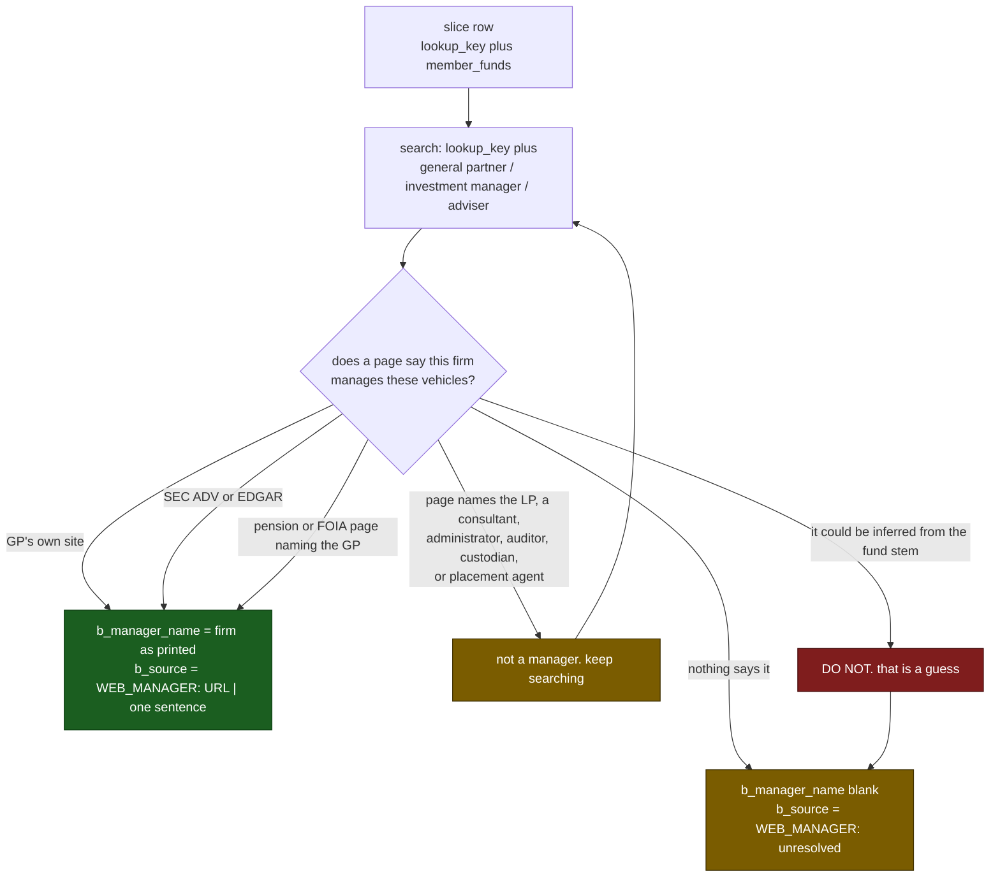

# Web manager B: slice 02

*Generated by `name_normalization dispatch` from `03-WEB-MANAGER-B.md` and `manager-02-b.csv`. Regenerate this file; do not hand-edit it. Do not delete it when the slice is settled.*

- **Project root:** the repository root, the folder holding `README.md`; every path below is relative to it
- **Worksheet:** `data/normalization/worksheets/manager-02-b.csv`
- **Slice:** 24 GP lookups, covering 24 funds; 24 already finished in an earlier session. Every row is finished. This file stays: it is the standing brief for this slice.
- **Written cells:** `b_manager_name`, `b_source` in that file, and nothing else anywhere.

**Resuming.** A row whose cells are already filled is finished work, from an earlier session or an earlier attempt at this slice. Skip it, start at the first empty row, and never clear or rewrite a filled cell. Sessions do fail part way through, and the only thing that loses work is starting over.

> **Binding:** Do not dispatch sub-agents. Do not use Python, scripts, or regex to extract. Read every row directly and write every cell by hand.

> ## ONE FILE IS WRITTEN
>
> The one slice named at the top of this prompt, under
> `data/normalization/worksheets/`
>
> Fill only `b_manager_name` and `b_source`. Those are the only two
> columns the file has. Agent A works a separate file that stays closed here, and
> another searcher owns every other slice. Touch no matrix, no work order, no
> round file under `data/`, and no ledger under `ledgers/`.

## One row is one sponsor, not one fund

`lookup_kind` is `family` or `fund`. A `family` row lists several vehicles in
`member_funds` that one general partner runs, so the search runs **once** and the
answer covers all of them. Search the family name, and use `member_funds` to
confirm the page is about these vehicles. A `fund` row is a single vehicle with
no siblings in the corpus.

Name the manager of the family as a whole. When members turn out to have
different managers, leave the name blank and say so in `b_source` after
`WEB_MANAGER: `, so the adjudicator can split the row.

Web search only. This brief is for Agent B. The slice is one part of a round split across
several searchers; the header above states its size.

## Columns written

| Column | Action |
|---|---|
| `b_manager_name` | The GP, adviser, or management company of **that fund**, as a public source names it |
| `b_source` | Prefix `WEB_MANAGER: ` then the URL, a pipe, and one short published sentence |

Copy the published firm name including the legal suffix the source used. Do not add `LLC` or `L.P.` the source omitted. One name per row. When a GP and an adviser are both named, take the investment manager or GP.

On search failure leave `b_manager_name` blank and write `WEB_MANAGER: unresolved` in `b_source`. Do not write `unresolved` into the name cell.

## Rules

A manager is the GP, adviser, or management company. The LP (PSERS, Oregon, Northumberland), a consultant (Meketa, Hamilton Lane, Aon), an administrator (SS&C), an auditor, a custodian, and a placement agent are none of those.

Do not guess from the fund stem. A family named `Five Point Energy` does not establish that a firm of that name exists until a page says so.

Prefer, in order: the GP's own site, SEC ADV or EDGAR, a pension or FOIA page naming the GP of this fund. Paywalled snippets are usable only for the firm name they actually display.

Some queued rows will turn out to be portfolio totals or asset-class lines a document printed as if they were funds, `Real Estate (Net)` among them. Leave those unresolved and say so in the report; do not invent a manager for an aggregate.

## Independence

Work alone. No Python. No bulk scrape. Write progressively, one fund at a time.

## Close

Every row in the slice has `b_manager_name` filled or deliberately blank, and `b_source` filled or marked `WEB_MANAGER: unresolved`. Report in at most six lines: names filled, unresolved, rows that were not funds, anything left unguessed.
