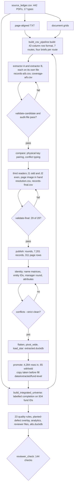

# Work stages

Stage table with commands: [`../PROCESS.md`](../PROCESS.md). Relational models: [`../docs/EXTRACTED-DATA-MODEL.md`](../docs/EXTRACTED-DATA-MODEL.md) for `extracted.duckdb`, [`../docs/DATA-MODEL.md`](../docs/DATA-MODEL.md) for `alts.duckdb`.
