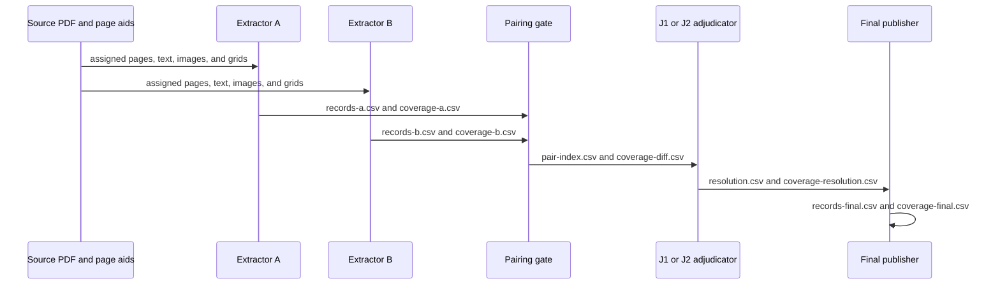

# SRC034 extraction evidence

Blind candidates, coverage, comparison, decisions, and final records for SRC034.

| File | Role |
|---|---|
| `records-a.csv` | Blind Extractor A observations. |
| `records-b.csv` | Blind Extractor B observations. |
| `coverage-a.csv` | Physical pages reviewed by Extractor A. |
| `coverage-b.csv` | Physical pages reviewed by Extractor B. |
| `pair-index.csv` | Paired agreements, disagreements, and one-sided candidate rows. |
| `coverage-diff.csv` | Page-level differences between the two extraction lanes. |
| `resolution.csv` | Adjudicator decisions for candidate pairs. |
| `coverage-resolution.csv` | Adjudicator decisions for page-coverage differences. |
| `records-final.csv` | Source-backed final observations for one document. |
| `coverage-final.csv` | Final physical-page coverage for one document. |

